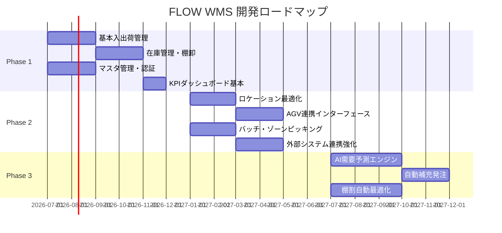

# FLOW WMS システム概要仕様書

**文書番号**: FLOW-WMS-SPEC-001  
**バージョン**: 1.0  
**作成日**: 2026-06-24  
**ステータス**: ドラフト

---

## 1. プロダクト概要

### 1.1 プロダクト名

**FLOW WMS**（フロー ウェアハウス マネジメント システム）

> "FLOW" は「物の流れ（Material Flow）」を管理するというコンセプトを体現したネーミングです。入荷から保管、出荷に至るまでの物流プロセス全体を一元的に可視化・制御し、滞りのない物の流れを実現します。

---

## 2. システムの目的・背景

### 2.1 背景

EC市場の急拡大および多品種少量配送ニーズの高まりにより、倉庫オペレーションの複雑性は年々増加しています。一方で、物流業界では深刻な人手不足が進行しており、限られた人員・設備で高い処理品質を維持することが急務となっています。

従来の紙帳票・Excelベースの在庫管理や、老朽化したオンプレミスWMSでは以下の課題が顕在化しています。

- 在庫精度の低下による機会損失・過剰在庫の併存
- ピッキングミス・誤出荷による顧客クレームの増加
- 作業進捗の非可視化によるマネジメントコストの増大
- ERP・取引先システムとの連携における手作業の多さ

### 2.2 システムの目的

FLOW WMS は、現代の物流現場が抱える上記課題を解決するために開発する次世代型倉庫管理システムです。以下の3つの価値提供を核としています。

| 価値 | 目標指標 |
|------|----------|
| **物流コスト削減** | 作業工数 20%削減、誤出荷率 0.01%以下 |
| **在庫精度向上** | 在庫精度 99.5%以上、棚卸差異 0.1%以内 |
| **作業効率化** | ピッキング生産性 30%向上、入出荷処理時間 40%短縮 |

---

## 3. システム全体アーキテクチャ

### 3.1 アーキテクチャ概要図

```mermaid
graph TB
    subgraph クライアント層
        PC[PCブラウザ<br/>管理者・監督者]
        HT[ハンディターミナル<br/>PWA / Android]
        FK[フォークリフト端末<br/>タブレット]
    end

    subgraph ネットワーク層
        CDN[CDN<br/>Cloudflare]
        LB[ロードバランサー<br/>Nginx]
    end

    subgraph アプリケーション層
        WEB[Next.js 15<br/>App Router<br/>SSR / API Routes]
        WS[WebSocket Server<br/>リアルタイム通知]
        AUTH[NextAuth v5<br/>認証・認可]
    end

    subgraph キャッシュ層
        REDIS[(Redis<br/>セッション・キャッシュ<br/>Pub/Sub)]
    end

    subgraph データ層
        PG_PRIMARY[(PostgreSQL<br/>Primary<br/>Read/Write)]
        PG_REPLICA[(PostgreSQL<br/>Replica<br/>Read Only)]
        PG_BOUNCER[PgBouncer<br/>コネクションプール]
    end

    subgraph 外部システム連携
        ERP[ERP<br/>受発注データ]
        EDI[EDI<br/>取引先]
        WCS[WCS<br/>倉庫制御]
        PRINTER[ラベルプリンタ]
    end

    subgraph 運用・監視
        PROM[Prometheus<br/>メトリクス収集]
        GRAFANA[Grafana<br/>ダッシュボード]
        LOG[構造化ログ<br/>ログ管理基盤]
    end

    PC --> CDN
    HT --> CDN
    FK --> CDN
    CDN --> LB
    LB --> WEB
    LB --> WS
    WEB --> AUTH
    WEB --> REDIS
    WEB --> PG_BOUNCER
    WS --> REDIS
    PG_BOUNCER --> PG_PRIMARY
    PG_BOUNCER --> PG_REPLICA
    PG_PRIMARY --> PG_REPLICA
    WEB --> ERP
    WEB --> EDI
    WEB --> WCS
    WEB --> PRINTER
    WEB --> PROM
    WS --> PROM
    PROM --> GRAFANA
    WEB --> LOG
```

### 3.2 デプロイ構成図

```mermaid
graph LR
    subgraph 開発・CI
        GH[GitHub<br/>ソースコード]
        GHA[GitHub Actions<br/>CI/CD Pipeline]
    end

    subgraph 本番環境 Docker Compose / Kubernetes
        APP1[App Server 1<br/>Next.js]
        APP2[App Server 2<br/>Next.js]
        WS_SRV[WebSocket<br/>Server]
        REDIS_SRV[Redis<br/>Cluster]
        PG_M[PostgreSQL<br/>Primary]
        PG_S[PostgreSQL<br/>Replica]
    end

    subgraph バックアップ
        S3[オブジェクトストレージ<br/>Daily Dump + WAL]
    end

    GH --> GHA
    GHA --> APP1
    GHA --> APP2
    GHA --> WS_SRV
    PG_M --> S3
```

---

## 4. 主要機能一覧

| No | 機能カテゴリ | 主な機能 | 対象ユーザー |
|----|-------------|----------|-------------|
| 1 | **入荷管理** | 入荷予定登録、入荷検品、ロケーション自動割付、差異処理 | 入出荷担当者、ピッカー |
| 2 | **出荷管理** | 出荷指示、ピッキング指示（4方式）、検品・梱包、出荷確認 | 入出荷担当者、ピッカー |
| 3 | **在庫管理** | リアルタイム在庫照会、在庫引当、在庫移動、棚卸 | 倉庫管理者、入出荷担当者 |
| 4 | **ロケーション管理** | レイアウト定義、属性管理、稼働率可視化、棚割最適化 | 倉庫管理者 |
| 5 | **作業指示・進捗管理** | 作業者指示配信、進捗監視、生産性レポート、AGV連携 | 倉庫管理者、作業者全般 |
| 6 | **マスタ管理** | 品目・取引先・ロケーション・ユーザー・車両マスタ | システム管理者、倉庫管理者 |
| 7 | **KPIダッシュボード** | 入出荷件数、稼働率、ピッキング精度、在庫回転率、アラート | 倉庫管理者 |
| 8 | **外部連携** | ERP・EDI・WCS・ハンディ端末・ラベルプリンタ連携 | システム管理者 |

---

## 5. ユーザー種別

### 5.1 ユーザーロール一覧

| ロール | 役割 | 主な利用機能 | 利用デバイス |
|--------|------|-------------|-------------|
| **倉庫管理者** | 倉庫全体の運営管理・監督 | KPIダッシュボード、ロケーション管理、作業進捗監視、各種マスタ参照 | PC/ブラウザ |
| **入出荷担当者** | 入荷受付・出荷手配・検品業務 | 入荷管理、出荷管理、在庫照会、差異処理 | PC/ブラウザ、ハンディターミナル |
| **ピッカー** | 商品のピッキング・格納作業 | ピッキング指示受信、スキャン検品、在庫移動 | ハンディターミナル、フォークリフト端末 |
| **システム管理者** | システム設定・ユーザー管理・外部連携設定 | マスタ管理全般、ユーザー管理、外部連携設定、ログ参照 | PC/ブラウザ |

---

## 6. 対応デバイス

### 6.1 PCブラウザ（管理画面）

- 対応ブラウザ: Google Chrome / Microsoft Edge（各最新2バージョン）
- 推奨解像度: 1280×768以上（フルHD 1920×1080推奨）
- 機能: 全管理機能（KPIダッシュボード・マスタ管理・各種帳票出力）

### 6.2 ハンディターミナル（PWA対応）

- 対応OS: Android 10以上
- 通信方式: WiFi（IEEE 802.11 a/b/g/n/ac）
- 対応機器: 標準Androidスマートフォン、Zebra / Honeywell 系バーコード端末
- 機能: ピッキング指示受信、バーコード/QRスキャン検品、在庫照会、棚卸
- PWA対応により専用アプリインストール不要、ブラウザで動作

### 6.3 フォークリフト端末（タブレット）

- 対応OS: Android 10以上
- 画面サイズ: 10インチ以上のタブレット端末
- 機能: フォークリフト作業指示受信、パレット移動指示、AGV連携表示
- 防塵・防水対応端末推奨（IP54以上）

---

## 7. 技術スタック

### 7.1 フロントエンド

| 技術 | バージョン | 用途 |
|------|-----------|------|
| Next.js | 15（App Router） | フレームワーク（SSR・SSG・API Routes） |
| TypeScript | 5.x | 型安全な開発 |
| Tailwind CSS | 3.x | UIスタイリング |
| shadcn/ui | 最新 | UIコンポーネントライブラリ |
| React Hook Form | 7.x | フォーム管理 |
| Zod | 3.x | バリデーションスキーマ |
| Recharts | 2.x | KPIグラフ・チャート |

### 7.2 バックエンド

| 技術 | バージョン | 用途 |
|------|-----------|------|
| Next.js API Routes | 15 | RESTful API エンドポイント |
| NextAuth | v5 | 認証・セッション管理 |
| Prisma | 5.x | ORM（型安全DBアクセス） |
| WebSocket（ws） | 8.x | リアルタイム通知・進捗配信 |
| Redis | 7.x | セッション・キャッシュ・Pub/Sub |

### 7.3 データベース・インフラ

| 技術 | バージョン | 用途 |
|------|-----------|------|
| PostgreSQL | 16 | メインRDBMS |
| PgBouncer | 1.x | コネクションプール |
| Redis | 7.x | キャッシュ・セッション |
| Docker / Docker Compose | 最新 | コンテナ化・ローカル開発環境 |
| Nginx | 1.x | リバースプロキシ・ロードバランサー |

### 7.4 開発・運用ツール

| 技術 | 用途 |
|------|------|
| GitHub Actions | CI/CD パイプライン |
| Prometheus | メトリクス収集 |
| Grafana | 監視ダッシュボード |
| Vitest | ユニットテスト |
| Playwright | E2Eテスト |
| ESLint / Prettier | コード品質・フォーマット |

---

## 8. 開発フェーズ計画

### 8.1 フェーズ概要



### 8.2 Phase 1: 基本入出荷・在庫管理

**期間**: 2026年7月〜2026年12月（6ヶ月）  
**目標**: 日常的な倉庫オペレーションを紙・Excelから置き換えられるレベルの基本機能

| 機能 | 詳細 |
|------|------|
| 基本入荷管理 | 入荷予定登録・入荷検品・ロケーション割付 |
| 基本出荷管理 | 出荷指示・シングルピッキング・出荷確認 |
| 在庫管理基本 | リアルタイム在庫照会・在庫移動・基本棚卸 |
| マスタ管理 | 品目・取引先・ロケーション・ユーザーマスタ |
| 認証・権限 | JWT認証・ロールベースアクセス制御 |
| KPI基本 | 当日の入出荷件数・在庫サマリー |

### 8.3 Phase 2: ロケーション最適化・AGV連携

**期間**: 2027年1月〜2027年6月（6ヶ月）  
**目標**: ピッキング効率の最大化と自動化設備との連携

| 機能 | 詳細 |
|------|------|
| ロケーション最適化 | 動的スロッティング・稼働率分析・棚割提案 |
| AGV連携 | AGV作業指示API・進捗フィードバック受信 |
| 高度なピッキング | バッチ・ゾーン・ウェーブピッキング対応 |
| 外部連携強化 | ERP・EDI・WCSとのリアルタイム連携 |
| 高度KPI | ピッキング精度・生産性・在庫回転率 |

### 8.4 Phase 3: AI需要予測・自動補充

**期間**: 2027年7月〜2027年12月（6ヶ月）  
**目標**: データ活用による予測的倉庫運営の実現

| 機能 | 詳細 |
|------|------|
| AI需要予測 | 過去の出荷実績を用いた品目別需要予測モデル |
| 自動補充発注 | 予測在庫量に基づくERP自動発注連携 |
| 棚割自動最適化 | 出荷頻度・季節性を考慮したロケーション自動割付 |
| 異常検知 | 在庫差異・作業効率異常の自動検知・アラート |

---

## 9. 用語定義

| 用語 | 定義 |
|------|------|
| WMS | Warehouse Management System。倉庫管理システム。 |
| ロケーション | 商品を保管する棚の特定の場所。棟・エリア・棚・段・列の組み合わせで一意に識別される。 |
| ピッキング | 出荷指示に従い、ロケーションから商品を取り出す作業。 |
| スロッティング | 商品をどのロケーションに保管するかを最適化する管理手法。 |
| AGV | Automated Guided Vehicle。自律走行搬送車。 |
| WCS | Warehouse Control System。倉庫制御システム。コンベアやソーターなどの設備を制御する。 |
| EDI | Electronic Data Interchange。電子データ交換。受発注情報を標準フォーマットで電子的にやり取りする仕組み。 |
| FEFO | First Expired First Out。賞味期限が早いものから先に出荷する引当方式。 |
| FIFO | First In First Out。先に入荷したものから先に出荷する引当方式（先入先出）。 |
| サイクルカウント | 倉庫を止めずに区画ごとに分けて行う部分棚卸手法。 |

---

---

## 10. 市場戦略・ビジネスモデル

> T-WINSシニアエンジニア＋戦略コンサルタント視点による事業化分析（2026年6月）

### 10.1 商業化評価サマリー

| 評価軸 | 現仕様の評価 | 改善後の評価 |
|------|------------|------------|
| 技術完成度 | ★★★★☆（高品質） | ★★★★★ |
| 市場ポジショニング | ★☆☆☆☆（未定義） | ★★★★☆ |
| EC市場対応 | ★☆☆☆☆（未対応） | ★★★★★ |
| 収益モデル | ★☆☆☆☆（未定義） | ★★★★☆ |
| **総合スコア** | **★★☆☆☆（このままでは売れない）** | **★★★★☆（スタートアップ主力商品として成立）** |

**現仕様の根本課題**: 「T-WMS同等」は価値提案ではなく機能チェックリストに過ぎない。T-WINSが5,000万〜2億円かけて提供する機能を再実装しても、ブランド・実績・サポート体制で既存ベンダーに負ける。**戦場を変える必要がある。**

### 10.2 ターゲット市場の再定義

FLOW WMSは「**EC特化型 SaaS-WMS**」として市場投入する。製造業向け大規模WMS（導入コスト5,000万〜2億円、期間6〜18ヶ月）との正面競合を避け、EC拡大で急成長しながら適切なWMSを持てない中小EC・3PL事業者を主戦場とする。

#### ターゲットセグメント

| セグメント | 規模感 | 現在の課題 | FLOW WMSの解決策 |
|----------|------|----------|----------------|
| **中小EC事業者（D2C）** | 月間受注1,000〜50,000件 | ExcelとFBA管理が限界。既存WMSはEC連携が弱い | Amazon/楽天/ShopifyネイティブAPI連携 |
| **中小3PL事業者** | 荷主5〜50社、倉庫1〜5棟 | 複数荷主を1システムで管理できず二重入力 | マルチクライアント管理＋クライアントポータル |
| **自社倉庫を持つEC事業者** | 年商1億〜50億円 | 成長とともにシステムが限界、刷新コストが怖い | SaaS月額3万円〜、2週間以内導入 |
| **地域物流会社** | 単一倉庫〜3拠点 | T-WINSは高額・導入期間が長すぎる | SaaS課金で低リスク・短期導入 |

#### 競合ポジショニング

```
高機能
    │         [SAP EWM]
    │          [T-WINS]        ← 製造業大手。高額・長期間
    │
    │         ★ FLOW WMS ← ここを制圧する
    │       （EC特化×コスト1/10×導入1/10の期間）
    │
    │  [Logiless]    [Zaico]  ← EC特化だが倉庫管理機能が弱い
低機能
    └────────────────────────
     高価格（億単位）    低価格（SaaS）
```

#### 競合比較表（キラー差別化要素）

| 比較軸 | FLOW WMS | T-WINS | Logiless | Zaico |
|--------|---------|--------|---------|-------|
| Amazon/楽天/Yahoo/Shopify ネイティブ連携 | ✅ | ❌ | ⚠️一部 | ❌ |
| ヤマト/佐川/ゆうパック 送り状自動発行 | ✅ | ⚠️別途開発 | ✅ | ❌ |
| 返品・返金管理（EC向け） | ✅ | ❌ | ⚠️ | ❌ |
| 3PLマルチクライアント | ✅ | ✅ | ❌ | ❌ |
| SaaS月額・即日トライアル | ✅ | ❌ | ✅ | ✅ |
| バーコード/ハンディ端末（本格倉庫向け） | ✅ | ✅ | ⚠️ | ❌ |
| AGV・WCS連携 | ✅（Phase2） | ✅ | ❌ | ❌ |
| **導入期間** | **1〜4週間** | 6〜18ヶ月 | 1〜2週間 | 即日 |
| **初期費用** | **¥0** | ¥5,000万〜 | ¥0 | ¥0 |
| **月額費用** | **¥3万〜** | ¥500万〜/年保守 | ¥3万〜 | ¥1万〜 |

### 10.3 SaaSビジネスモデル

#### プラン設計

| プラン | 月額（税抜） | 月間処理件数 | ユーザー数 | 倉庫数 | 主要付加機能 |
|------|------------|------------|---------|------|-----------|
| **フリー** | ¥0 | 〜100件 | 2名 | 1倉庫 | 基本WMS機能（トライアル用） |
| **スターター** | ¥30,000 | 〜3,000件 | 10名 | 1倉庫 | ECプラットフォーム連携2社まで |
| **グロース** | ¥100,000 | 〜30,000件 | 30名 | 3倉庫 | 全ECプラットフォーム＋3PL対応 |
| **エンタープライズ** | ¥300,000〜 | 無制限 | 無制限 | 無制限 | 専任サポート＋AGV連携＋カスタム開発 |

#### ARR成長シミュレーション

| 時期 | スターター | グロース | エンタープライズ | ARR合計 |
|------|----------|---------|--------------|--------|
| 1年後（βテスト完了） | 30社 × ¥36万 = ¥10.8M | 5社 × ¥120万 = ¥6M | — | **約¥17M** |
| 3年後 | 150社 × ¥36万 = ¥54M | 40社 × ¥120万 = ¥48M | 8社 × ¥420万 = ¥33.6M | **約¥135M** |
| 5年後 | 400社 × ¥36万 = ¥144M | 120社 × ¥120万 = ¥144M | 20社 × ¥480万 = ¥96M | **約¥384M** |

> **5年後ARR目標: ¥384M（約3.8億円）**  
> WMSはスイッチングコストが高いため月次チャーン2%以下が現実的。粗利率70〜80%のSaaS事業として成立する。

#### ユニットエコノミクス目標

| KPI | 目標値 | 根拠 |
|-----|--------|------|
| CAC（顧客獲得コスト） | ¥200,000〜¥500,000 | WMSは商談・導入支援に工数を要する |
| LTV（顧客生涯価値） | ¥3,000,000〜¥10,000,000 | スイッチングコスト高・平均継続4〜6年 |
| LTV/CAC比率 | 6〜15倍 | 健全SaaS指標の3倍以上を達成 |

### 10.4 商業化優先ロードマップ（Phase再設計）

収益化を最優先に、既存の開発フェーズを以下の通り再設計する。

```
Phase 1（〜2026年12月）: EC Starter MVP ← 最優先
  ├── 基本WMS機能（入荷・出荷・在庫）
  ├── ★ Amazon/Shopify 受注API連携
  ├── ★ ヤマト/佐川/ゆうパック 送り状自動発行
  ├── SaaS フリー/スターター プラン基盤（Stripe課金）
  └── βテスト: 自社EC倉庫を持つ3社で実証検証

Phase 2（2027年1〜6月）: 3PL・EC全プラットフォーム
  ├── マルチクライアント（3PL）完全対応
  ├── 楽天市場/Yahoo!ショッピング/BASE 連携追加
  ├── 返品・返金管理（EC特有の業務）
  └── グロースプラン本格提供開始

Phase 3（2027年7〜12月）: AI・大規模化
  ├── AI需要予測エンジン
  ├── AGV連携（大規模3PL・製造業エンタープライズ向け）
  └── ARR ¥100M 達成目標
```

---

*本ドキュメントは FLOW WMS のシステム概要を定義するものです。詳細な機能要件は「02_機能要件.md」、非機能要件は「03_非機能要件.md」を参照してください。*
