# FLOW WMS データベース設計仕様書

| 項目 | 内容 |
|------|------|
| システム名 | FLOW WMS（倉庫管理システム） |
| バージョン | 1.0.0 |
| 作成日 | 2026-06-24 |
| RDBMS | PostgreSQL 16 |
| 文字コード | UTF-8 |
| タイムゾーン | UTC（アプリケーション層でローカル変換） |

---

## 目次

1. [設計方針](#設計方針)
2. [ER図](#er図)
3. [DDL（CREATE TABLE）](#ddl)
   - [マスタ系](#マスタ系)
   - [入荷系](#入荷系)
   - [出荷系](#出荷系)
   - [在庫系](#在庫系)
4. [インデックス設計](#インデックス設計)
5. [Row Level Security（RLS）](#row-level-security)
6. [パーティション設計](#パーティション設計)

---

## 設計方針

| 項目 | 方針 |
|------|------|
| 主キー | 全テーブルに `id UUID PRIMARY KEY DEFAULT gen_random_uuid()` |
| タイムスタンプ | `created_at TIMESTAMPTZ DEFAULT now()` / `updated_at TIMESTAMPTZ DEFAULT now()` |
| 論理削除 | 使用しない。削除は物理削除、履歴は `inventory_transactions` で管理 |
| 楽観的ロック | `inventory` テーブルに `version INTEGER NOT NULL DEFAULT 0` を追加し UPDATE 時にインクリメント |
| 外部キー | 全参照に `FOREIGN KEY ... REFERENCES` を設定。ON DELETE は原則 RESTRICT |
| 列挙型 | PostgreSQL の `ENUM` 型として定義 |
| RLS | `warehouse_id` ベースで各テーブルにポリシーを適用 |
| インデックス | 検索・結合・ソートに使用する列に B-tree インデックスを設定。トランザクション系テーブルの日時列には BRIN インデックスを検討 |
| 数値精度 | 金額は `NUMERIC(15,2)`、重量・容量は `NUMERIC(10,4)` |

---

## ER図

```mermaid
erDiagram
    warehouses {
        uuid id PK
        varchar code
        varchar name
        text address
        varchar timezone
        timestamptz created_at
    }

    zones {
        uuid id PK
        uuid warehouse_id FK
        varchar code
        varchar name
        zone_type zone_type
        temp_zone_type temp_zone
    }

    locations {
        uuid id PK
        uuid zone_id FK
        varchar code
        varchar aisle
        varchar bay
        varchar level
        varchar position
        numeric max_weight_kg
        numeric max_volume_m3
        location_status status
        location_type location_type
    }

    items {
        uuid id PK
        varchar sku
        varchar name
        text description
        varchar unit_of_measure
        numeric weight_kg
        numeric volume_m3
        varchar barcode
        storage_condition storage_condition
        integer shelf_life_days
        integer reorder_point
        integer reorder_quantity
        timestamptz created_at
        timestamptz updated_at
    }

    partners {
        uuid id PK
        varchar code
        varchar name
        partner_type partner_type
        text address
        varchar contact_email
        timestamptz created_at
    }

    users {
        uuid id PK
        varchar email
        varchar password_hash
        varchar name
        user_role role
        uuid warehouse_id FK
        timestamptz created_at
    }

    equipment {
        uuid id PK
        uuid warehouse_id FK
        equipment_type equipment_type
        varchar code
        varchar name
        equipment_status status
    }

    purchase_orders {
        uuid id PK
        varchar po_number
        uuid partner_id FK
        uuid warehouse_id FK
        date expected_date
        po_status status
        uuid created_by FK
        timestamptz created_at
    }

    purchase_order_lines {
        uuid id PK
        uuid po_id FK
        uuid item_id FK
        integer ordered_qty
        integer received_qty
        numeric unit_price
    }

    receiving_sessions {
        uuid id PK
        uuid po_id FK
        uuid started_by FK
        timestamptz started_at
        timestamptz completed_at
        session_status status
    }

    receiving_records {
        uuid id PK
        uuid session_id FK
        uuid po_line_id FK
        uuid item_id FK
        uuid location_id FK
        varchar lot_number
        date expiry_date
        integer received_qty
        varchar scanned_barcode
        timestamptz created_at
    }

    sales_orders {
        uuid id PK
        varchar so_number
        uuid partner_id FK
        uuid warehouse_id FK
        date requested_date
        so_status status
        uuid created_by FK
        timestamptz created_at
    }

    sales_order_lines {
        uuid id PK
        uuid so_id FK
        uuid item_id FK
        integer ordered_qty
        integer picked_qty
        numeric unit_price
    }

    picking_tasks {
        uuid id PK
        uuid so_id FK
        uuid assigned_to FK
        picking_task_type task_type
        picking_task_status status
        timestamptz created_at
    }

    picking_task_lines {
        uuid id PK
        uuid task_id FK
        uuid so_line_id FK
        uuid item_id FK
        uuid from_location_id FK
        varchar lot_number
        integer quantity
        integer picked_qty
        picking_line_status status
        timestamptz scanned_at
    }

    shipments {
        uuid id PK
        uuid so_id FK
        varchar tracking_number
        timestamptz shipped_at
        varchar carrier
        shipment_status status
    }

    inventory {
        uuid id PK
        uuid warehouse_id FK
        uuid item_id FK
        uuid location_id FK
        varchar lot_number
        date expiry_date
        integer quantity
        integer reserved_qty
        integer version
        timestamptz last_updated
    }

    inventory_transactions {
        uuid id PK
        uuid warehouse_id FK
        uuid item_id FK
        uuid location_id FK
        varchar lot_number
        transaction_type transaction_type
        integer quantity_change
        integer quantity_after
        varchar reference_type
        uuid reference_id
        uuid created_by FK
        timestamptz created_at
    }

    stocktake_sessions {
        uuid id PK
        uuid warehouse_id FK
        stocktake_type session_type
        stocktake_status status
        timestamptz started_at
        timestamptz completed_at
        uuid created_by FK
    }

    stocktake_records {
        uuid id PK
        uuid session_id FK
        uuid location_id FK
        uuid item_id FK
        varchar lot_number
        integer system_qty
        integer counted_qty
        integer variance
        stocktake_record_status status
    }

    warehouses ||--o{ zones : "has"
    warehouses ||--o{ users : "belongs_to"
    warehouses ||--o{ equipment : "has"
    warehouses ||--o{ purchase_orders : "receives_at"
    warehouses ||--o{ sales_orders : "ships_from"
    warehouses ||--o{ inventory : "stores"
    warehouses ||--o{ inventory_transactions : "records"
    warehouses ||--o{ stocktake_sessions : "conducts"

    zones ||--o{ locations : "contains"

    locations ||--o{ receiving_records : "receives_into"
    locations ||--o{ picking_task_lines : "picks_from"
    locations ||--o{ inventory : "holds"
    locations ||--o{ stocktake_records : "counted_at"

    items ||--o{ purchase_order_lines : "ordered_in"
    items ||--o{ receiving_records : "received_as"
    items ||--o{ sales_order_lines : "sold_in"
    items ||--o{ picking_task_lines : "picked_as"
    items ||--o{ inventory : "stocked_as"
    items ||--o{ inventory_transactions : "transacted_as"
    items ||--o{ stocktake_records : "counted_as"

    partners ||--o{ purchase_orders : "supplies"
    partners ||--o{ sales_orders : "orders"

    users ||--o{ purchase_orders : "created_by"
    users ||--o{ sales_orders : "created_by"
    users ||--o{ receiving_sessions : "started_by"
    users ||--o{ picking_tasks : "assigned_to"
    users ||--o{ inventory_transactions : "created_by"
    users ||--o{ stocktake_sessions : "created_by"

    purchase_orders ||--o{ purchase_order_lines : "has"
    purchase_orders ||--o{ receiving_sessions : "triggers"

    purchase_order_lines ||--o{ receiving_records : "fulfilled_by"

    receiving_sessions ||--o{ receiving_records : "contains"

    sales_orders ||--o{ sales_order_lines : "has"
    sales_orders ||--o{ picking_tasks : "requires"
    sales_orders ||--|| shipments : "completed_as"

    sales_order_lines ||--o{ picking_task_lines : "picked_by"

    picking_tasks ||--o{ picking_task_lines : "contains"

    stocktake_sessions ||--o{ stocktake_records : "contains"
```



---

## DDL

### 事前準備: ENUM型・拡張機能

```sql
-- ====================================================
-- 事前準備: 拡張機能の有効化
-- ====================================================

-- UUID生成関数 (PostgreSQL 13以降は標準で利用可)
CREATE EXTENSION IF NOT EXISTS "pgcrypto";

-- ====================================================
-- ENUM 型定義
-- ====================================================

-- ゾーン種別
CREATE TYPE zone_type AS ENUM (
    'receiving',   -- 入荷エリア
    'storage',     -- 保管エリア
    'shipping',    -- 出荷エリア
    'staging'      -- ステージングエリア
);

-- 温度帯
CREATE TYPE temp_zone_type AS ENUM (
    'ambient',       -- 常温
    'refrigerated',  -- 冷蔵（1〜10℃）
    'frozen'         -- 冷凍（-18℃以下）
);

-- ロケーション状態
CREATE TYPE location_status AS ENUM (
    'active',    -- 使用可能
    'inactive',  -- 使用停止
    'blocked'    -- 封鎖中
);

-- ロケーション種別
CREATE TYPE location_type AS ENUM (
    'rack',        -- ラック棚
    'floor',       -- フロア置き
    'staging',     -- ステージング
    'cross_dock'   -- クロスドック
);

-- 品目保管条件
CREATE TYPE storage_condition AS ENUM (
    'ambient',
    'refrigerated',
    'frozen'
);

-- 取引先種別
CREATE TYPE partner_type AS ENUM (
    'supplier',   -- 仕入先
    'customer',   -- 出荷先
    'both'        -- 両方
);

-- ユーザーロール
CREATE TYPE user_role AS ENUM (
    'admin',               -- 管理者
    'warehouse_manager',   -- 倉庫マネージャー
    'operator',            -- オペレーター
    'picker',              -- ピッカー
    'readonly'             -- 参照のみ
);

-- 機器種別
CREATE TYPE equipment_type AS ENUM (
    'forklift',        -- フォークリフト
    'agv',             -- 自動搬送車
    'handy_terminal',  -- ハンディ端末
    'printer'          -- プリンター
);

-- 機器状態
CREATE TYPE equipment_status AS ENUM (
    'active',       -- 稼働中
    'maintenance',  -- メンテナンス中
    'offline'       -- オフライン
);

-- 発注状態
CREATE TYPE po_status AS ENUM (
    'planned',      -- 計画中
    'in_progress',  -- 入荷進行中
    'completed',    -- 完了
    'cancelled'     -- キャンセル
);

-- 入荷セッション状態
CREATE TYPE session_status AS ENUM (
    'in_progress',  -- 作業中
    'completed',    -- 完了
    'cancelled'     -- キャンセル
);

-- 受注状態
CREATE TYPE so_status AS ENUM (
    'planned',      -- 計画中
    'picking',      -- ピッキング中
    'inspecting',   -- 検品中
    'shipped',      -- 出荷済
    'cancelled'     -- キャンセル
);

-- ピッキングタスク種別
CREATE TYPE picking_task_type AS ENUM (
    'single',  -- シングルオーダー
    'batch',   -- バッチ
    'zone',    -- ゾーン別
    'wave'     -- ウェーブ
);

-- ピッキングタスク状態
CREATE TYPE picking_task_status AS ENUM (
    'pending',      -- 未開始
    'in_progress',  -- 進行中
    'completed'     -- 完了
);

-- ピッキングタスク明細状態
CREATE TYPE picking_line_status AS ENUM (
    'pending',    -- 未実施
    'picked',     -- ピッキング完了
    'short',      -- 在庫不足
    'skipped'     -- スキップ
);

-- 出荷状態
CREATE TYPE shipment_status AS ENUM (
    'preparing',  -- 準備中
    'shipped',    -- 出荷済
    'cancelled'   -- キャンセル
);

-- 在庫トランザクション種別
CREATE TYPE transaction_type AS ENUM (
    'receiving',   -- 入荷
    'shipping',    -- 出荷
    'adjustment',  -- 調整（棚卸差異など）
    'move',        -- ロケーション移動
    'stocktake'    -- 棚卸
);

-- 棚卸種別
CREATE TYPE stocktake_type AS ENUM (
    'full',   -- 全棚卸
    'cycle'   -- 循環棚卸
);

-- 棚卸状態
CREATE TYPE stocktake_status AS ENUM (
    'planned',      -- 計画中
    'in_progress',  -- 実施中
    'completed',    -- 完了
    'cancelled'     -- キャンセル
);

-- 棚卸実績状態
CREATE TYPE stocktake_record_status AS ENUM (
    'pending',   -- カウント未実施
    'counted',   -- カウント完了（承認待ち）
    'approved'   -- 承認済
);
```

---

### マスタ系

```sql
-- ====================================================
-- 倉庫マスタ (warehouses)
-- ====================================================
CREATE TABLE warehouses (
    id          UUID         NOT NULL DEFAULT gen_random_uuid(),
    code        VARCHAR(20)  NOT NULL,                   -- 倉庫コード（例: TYO-DC）
    name        VARCHAR(200) NOT NULL,                   -- 倉庫名
    address     TEXT,                                    -- 住所
    timezone    VARCHAR(50)  NOT NULL DEFAULT 'Asia/Tokyo', -- タイムゾーン
    created_at  TIMESTAMPTZ  NOT NULL DEFAULT now(),

    CONSTRAINT pk_warehouses PRIMARY KEY (id),
    CONSTRAINT uq_warehouses_code UNIQUE (code)
);

COMMENT ON TABLE  warehouses          IS '倉庫マスタ';
COMMENT ON COLUMN warehouses.id       IS '倉庫ID（UUID）';
COMMENT ON COLUMN warehouses.code     IS '倉庫コード（システム内一意）';
COMMENT ON COLUMN warehouses.name     IS '倉庫名称';
COMMENT ON COLUMN warehouses.address  IS '倉庫所在地';
COMMENT ON COLUMN warehouses.timezone IS 'IANAタイムゾーン識別子';


-- ====================================================
-- ゾーンマスタ (zones)
-- ====================================================
CREATE TABLE zones (
    id           UUID           NOT NULL DEFAULT gen_random_uuid(),
    warehouse_id UUID           NOT NULL,               -- 所属倉庫
    code         VARCHAR(20)    NOT NULL,               -- ゾーンコード
    name         VARCHAR(100)   NOT NULL,               -- ゾーン名
    zone_type    zone_type      NOT NULL,               -- ゾーン種別
    temp_zone    temp_zone_type NOT NULL DEFAULT 'ambient', -- 温度帯

    CONSTRAINT pk_zones              PRIMARY KEY (id),
    CONSTRAINT uq_zones_warehouse_code UNIQUE (warehouse_id, code),
    CONSTRAINT fk_zones_warehouse    FOREIGN KEY (warehouse_id)
        REFERENCES warehouses (id) ON DELETE RESTRICT
);

COMMENT ON TABLE  zones              IS 'ゾーンマスタ（倉庫内エリア区分）';
COMMENT ON COLUMN zones.zone_type   IS '入荷/保管/出荷/ステージング';
COMMENT ON COLUMN zones.temp_zone   IS '常温/冷蔵/冷凍';


-- ====================================================
-- ロケーションマスタ (locations)
-- ====================================================
CREATE TABLE locations (
    id             UUID            NOT NULL DEFAULT gen_random_uuid(),
    zone_id        UUID            NOT NULL,            -- 所属ゾーン
    code           VARCHAR(50)     NOT NULL,            -- ロケーションコード（例: A-01-02-L）
    aisle          VARCHAR(10)     NOT NULL,            -- 通路
    bay            VARCHAR(10)     NOT NULL,            -- 棚番号
    level          VARCHAR(10)     NOT NULL,            -- 段
    position       VARCHAR(10),                         -- 位置（左/右など）
    max_weight_kg  NUMERIC(10,4)   NOT NULL DEFAULT 0, -- 最大積載重量(kg)
    max_volume_m3  NUMERIC(10,4)   NOT NULL DEFAULT 0, -- 最大容量(m3)
    status         location_status NOT NULL DEFAULT 'active',
    location_type  location_type   NOT NULL DEFAULT 'rack',

    CONSTRAINT pk_locations          PRIMARY KEY (id),
    CONSTRAINT uq_locations_zone_code UNIQUE (zone_id, code),
    CONSTRAINT fk_locations_zone     FOREIGN KEY (zone_id)
        REFERENCES zones (id) ON DELETE RESTRICT,
    CONSTRAINT chk_locations_weight  CHECK (max_weight_kg >= 0),
    CONSTRAINT chk_locations_volume  CHECK (max_volume_m3 >= 0)
);

COMMENT ON TABLE  locations               IS 'ロケーションマスタ（格納棚の最小単位）';
COMMENT ON COLUMN locations.code          IS 'ロケーションコード（倉庫内一意）';
COMMENT ON COLUMN locations.max_weight_kg IS '最大積載重量(kg)。0は制限なし';
COMMENT ON COLUMN locations.max_volume_m3 IS '最大容量(m3)。0は制限なし';


-- ====================================================
-- 品目マスタ (items)
-- ====================================================
CREATE TABLE items (
    id                UUID              NOT NULL DEFAULT gen_random_uuid(),
    sku               VARCHAR(50)       NOT NULL,       -- SKU（在庫管理単位コード）
    name              VARCHAR(200)      NOT NULL,       -- 品目名
    description       TEXT,                             -- 品目説明
    unit_of_measure   VARCHAR(20)       NOT NULL,       -- 単位（個、箱、kg など）
    weight_kg         NUMERIC(10,4)     NOT NULL DEFAULT 0, -- 重量(kg)
    volume_m3         NUMERIC(10,4)     NOT NULL DEFAULT 0, -- 容量(m3)
    barcode           VARCHAR(50),                      -- バーコード（JAN/EAN/QR）
    storage_condition storage_condition NOT NULL DEFAULT 'ambient',
    shelf_life_days   INTEGER,                          -- 消費期限日数（NULLは無期限）
    reorder_point     INTEGER           NOT NULL DEFAULT 0, -- 発注点
    reorder_quantity  INTEGER           NOT NULL DEFAULT 0, -- 発注数量
    created_at        TIMESTAMPTZ       NOT NULL DEFAULT now(),
    updated_at        TIMESTAMPTZ       NOT NULL DEFAULT now(),

    CONSTRAINT pk_items              PRIMARY KEY (id),
    CONSTRAINT uq_items_sku          UNIQUE (sku),
    CONSTRAINT uq_items_barcode      UNIQUE (barcode),
    CONSTRAINT chk_items_weight      CHECK (weight_kg >= 0),
    CONSTRAINT chk_items_volume      CHECK (volume_m3 >= 0),
    CONSTRAINT chk_items_shelf_life  CHECK (shelf_life_days IS NULL OR shelf_life_days > 0),
    CONSTRAINT chk_items_reorder_pt  CHECK (reorder_point >= 0),
    CONSTRAINT chk_items_reorder_qty CHECK (reorder_quantity >= 0)
);

COMMENT ON TABLE  items                   IS '品目マスタ（SKU単位）';
COMMENT ON COLUMN items.sku               IS 'Stock Keeping Unit。システム全体で一意';
COMMENT ON COLUMN items.barcode           IS 'JANコード、EANコード、QRなど';
COMMENT ON COLUMN items.storage_condition IS '保管条件（常温/冷蔵/冷凍）';
COMMENT ON COLUMN items.shelf_life_days   IS '製造日からの消費期限日数。NULLは無期限品目';
COMMENT ON COLUMN items.reorder_point     IS '発注点。在庫がこの数量を下回ったらアラート';


-- ====================================================
-- 取引先マスタ (partners)
-- ====================================================
CREATE TABLE partners (
    id            UUID         NOT NULL DEFAULT gen_random_uuid(),
    code          VARCHAR(50)  NOT NULL,               -- 取引先コード
    name          VARCHAR(200) NOT NULL,               -- 取引先名
    partner_type  partner_type NOT NULL,               -- 仕入先/出荷先/両方
    address       TEXT,                                -- 住所
    contact_email VARCHAR(255),                        -- 担当者メール
    created_at    TIMESTAMPTZ  NOT NULL DEFAULT now(),

    CONSTRAINT pk_partners            PRIMARY KEY (id),
    CONSTRAINT uq_partners_code       UNIQUE (code),
    CONSTRAINT chk_partners_email     CHECK (contact_email IS NULL OR contact_email ~* '^[^@]+@[^@]+\.[^@]+$')
);

COMMENT ON TABLE  partners              IS '取引先マスタ（仕入先・出荷先）';
COMMENT ON COLUMN partners.partner_type IS 'supplier=仕入先, customer=出荷先, both=両方';


-- ====================================================
-- ユーザー (users)
-- ====================================================
CREATE TABLE users (
    id            UUID        NOT NULL DEFAULT gen_random_uuid(),
    email         VARCHAR(255) NOT NULL,               -- メールアドレス（ログインID）
    password_hash VARCHAR(255) NOT NULL,               -- Argon2idハッシュ
    name          VARCHAR(100) NOT NULL,               -- 表示名
    role          user_role    NOT NULL DEFAULT 'operator',
    warehouse_id  UUID,                                -- 担当倉庫（NULLは全倉庫）
    created_at    TIMESTAMPTZ  NOT NULL DEFAULT now(),

    CONSTRAINT pk_users           PRIMARY KEY (id),
    CONSTRAINT uq_users_email     UNIQUE (email),
    CONSTRAINT fk_users_warehouse FOREIGN KEY (warehouse_id)
        REFERENCES warehouses (id) ON DELETE SET NULL
);

COMMENT ON TABLE  users              IS 'システムユーザー';
COMMENT ON COLUMN users.email        IS 'ログインに使用するメールアドレス（一意）';
COMMENT ON COLUMN users.password_hash IS 'Argon2idによるパスワードハッシュ';
COMMENT ON COLUMN users.warehouse_id IS '担当倉庫ID。NULLの場合は全倉庫へのアクセスを許可';


-- ====================================================
-- 機器マスタ (equipment)
-- ====================================================
CREATE TABLE equipment (
    id             UUID             NOT NULL DEFAULT gen_random_uuid(),
    warehouse_id   UUID             NOT NULL,           -- 所属倉庫
    equipment_type equipment_type   NOT NULL,           -- 機器種別
    code           VARCHAR(50)      NOT NULL,           -- 機器コード
    name           VARCHAR(100)     NOT NULL,           -- 機器名
    status         equipment_status NOT NULL DEFAULT 'active',

    CONSTRAINT pk_equipment             PRIMARY KEY (id),
    CONSTRAINT uq_equipment_wh_code     UNIQUE (warehouse_id, code),
    CONSTRAINT fk_equipment_warehouse   FOREIGN KEY (warehouse_id)
        REFERENCES warehouses (id) ON DELETE RESTRICT
);

COMMENT ON TABLE  equipment              IS '機器マスタ（フォークリフト・AGV・ハンディ端末など）';
COMMENT ON COLUMN equipment.equipment_type IS 'forklift/agv/handy_terminal/printer';
```

---

### 入荷系

```sql
-- ====================================================
-- 発注（PO）ヘッダ (purchase_orders)
-- ====================================================
CREATE TABLE purchase_orders (
    id            UUID        NOT NULL DEFAULT gen_random_uuid(),
    po_number     VARCHAR(50) NOT NULL,                -- 発注番号（例: PO-2026-0001）
    partner_id    UUID        NOT NULL,                -- 仕入先
    warehouse_id  UUID        NOT NULL,                -- 入荷倉庫
    expected_date DATE        NOT NULL,                -- 入荷予定日
    status        po_status   NOT NULL DEFAULT 'planned',
    created_by    UUID        NOT NULL,                -- 作成ユーザー
    created_at    TIMESTAMPTZ NOT NULL DEFAULT now(),

    CONSTRAINT pk_purchase_orders          PRIMARY KEY (id),
    CONSTRAINT uq_purchase_orders_number   UNIQUE (po_number),
    CONSTRAINT fk_purchase_orders_partner  FOREIGN KEY (partner_id)
        REFERENCES partners (id) ON DELETE RESTRICT,
    CONSTRAINT fk_purchase_orders_wh       FOREIGN KEY (warehouse_id)
        REFERENCES warehouses (id) ON DELETE RESTRICT,
    CONSTRAINT fk_purchase_orders_user     FOREIGN KEY (created_by)
        REFERENCES users (id) ON DELETE RESTRICT
);

COMMENT ON TABLE  purchase_orders               IS '発注（Purchase Order）ヘッダ';
COMMENT ON COLUMN purchase_orders.po_number     IS '発注番号（システム全体で一意）';
COMMENT ON COLUMN purchase_orders.expected_date IS '入荷予定日';


-- ====================================================
-- 発注明細 (purchase_order_lines)
-- ====================================================
CREATE TABLE purchase_order_lines (
    id           UUID           NOT NULL DEFAULT gen_random_uuid(),
    po_id        UUID           NOT NULL,              -- 発注ヘッダ
    item_id      UUID           NOT NULL,              -- 品目
    ordered_qty  INTEGER        NOT NULL,              -- 発注数量
    received_qty INTEGER        NOT NULL DEFAULT 0,   -- 入荷済数量
    unit_price   NUMERIC(15,2)  NOT NULL DEFAULT 0,   -- 仕入単価

    CONSTRAINT pk_po_lines              PRIMARY KEY (id),
    CONSTRAINT uq_po_lines_po_item      UNIQUE (po_id, item_id),
    CONSTRAINT fk_po_lines_po           FOREIGN KEY (po_id)
        REFERENCES purchase_orders (id) ON DELETE CASCADE,
    CONSTRAINT fk_po_lines_item         FOREIGN KEY (item_id)
        REFERENCES items (id) ON DELETE RESTRICT,
    CONSTRAINT chk_po_lines_ordered_qty CHECK (ordered_qty > 0),
    CONSTRAINT chk_po_lines_received_qty CHECK (received_qty >= 0),
    CONSTRAINT chk_po_lines_price       CHECK (unit_price >= 0)
);

COMMENT ON TABLE  purchase_order_lines              IS '発注明細';
COMMENT ON COLUMN purchase_order_lines.received_qty IS '入荷検品により累計される実入荷数量';


-- ====================================================
-- 入荷セッション (receiving_sessions)
-- ====================================================
CREATE TABLE receiving_sessions (
    id           UUID           NOT NULL DEFAULT gen_random_uuid(),
    po_id        UUID           NOT NULL,              -- 対象発注
    started_by   UUID           NOT NULL,              -- 開始ユーザー
    started_at   TIMESTAMPTZ    NOT NULL DEFAULT now(),
    completed_at TIMESTAMPTZ,                          -- 完了日時（進行中はNULL）
    status       session_status NOT NULL DEFAULT 'in_progress',

    CONSTRAINT pk_receiving_sessions      PRIMARY KEY (id),
    CONSTRAINT fk_recv_sessions_po        FOREIGN KEY (po_id)
        REFERENCES purchase_orders (id) ON DELETE RESTRICT,
    CONSTRAINT fk_recv_sessions_user      FOREIGN KEY (started_by)
        REFERENCES users (id) ON DELETE RESTRICT,
    CONSTRAINT chk_recv_sessions_dates    CHECK (
        completed_at IS NULL OR completed_at >= started_at
    )
);

COMMENT ON TABLE  receiving_sessions             IS '入荷セッション（1回の入荷作業単位）';
COMMENT ON COLUMN receiving_sessions.completed_at IS 'status=completed 時に記録';


-- ====================================================
-- 入荷実績 (receiving_records)
-- ====================================================
CREATE TABLE receiving_records (
    id              UUID        NOT NULL DEFAULT gen_random_uuid(),
    session_id      UUID        NOT NULL,              -- 入荷セッション
    po_line_id      UUID        NOT NULL,              -- 発注明細
    item_id         UUID        NOT NULL,              -- 品目（非正規化・検索用）
    location_id     UUID        NOT NULL,              -- 格納先ロケーション
    lot_number      VARCHAR(50) NOT NULL,              -- ロット番号
    expiry_date     DATE,                              -- 賞味期限（期限管理品のみ）
    received_qty    INTEGER     NOT NULL,              -- 入荷数量
    scanned_barcode VARCHAR(50),                       -- スキャンバーコード（ログ用）
    created_at      TIMESTAMPTZ NOT NULL DEFAULT now(),

    CONSTRAINT pk_receiving_records          PRIMARY KEY (id),
    CONSTRAINT fk_recv_records_session       FOREIGN KEY (session_id)
        REFERENCES receiving_sessions (id) ON DELETE RESTRICT,
    CONSTRAINT fk_recv_records_po_line       FOREIGN KEY (po_line_id)
        REFERENCES purchase_order_lines (id) ON DELETE RESTRICT,
    CONSTRAINT fk_recv_records_item          FOREIGN KEY (item_id)
        REFERENCES items (id) ON DELETE RESTRICT,
    CONSTRAINT fk_recv_records_location      FOREIGN KEY (location_id)
        REFERENCES locations (id) ON DELETE RESTRICT,
    CONSTRAINT chk_recv_records_qty          CHECK (received_qty > 0)
);

COMMENT ON TABLE  receiving_records              IS '入荷実績（バーコードスキャン1回分を記録）';
COMMENT ON COLUMN receiving_records.lot_number   IS 'ロット番号（入力またはスキャンで取得）';
COMMENT ON COLUMN receiving_records.expiry_date  IS '賞味期限日。shelf_life_days=NULL の品目は NULL';
```

---

### 出荷系

```sql
-- ====================================================
-- 受注ヘッダ (sales_orders)
-- ====================================================
CREATE TABLE sales_orders (
    id             UUID        NOT NULL DEFAULT gen_random_uuid(),
    so_number      VARCHAR(50) NOT NULL,               -- 受注番号（例: SO-2026-0101）
    partner_id     UUID        NOT NULL,               -- 出荷先
    warehouse_id   UUID        NOT NULL,               -- 出荷倉庫
    requested_date DATE        NOT NULL,               -- 出荷希望日
    status         so_status   NOT NULL DEFAULT 'planned',
    created_by     UUID        NOT NULL,               -- 作成ユーザー
    created_at     TIMESTAMPTZ NOT NULL DEFAULT now(),

    CONSTRAINT pk_sales_orders            PRIMARY KEY (id),
    CONSTRAINT uq_sales_orders_number     UNIQUE (so_number),
    CONSTRAINT fk_sales_orders_partner    FOREIGN KEY (partner_id)
        REFERENCES partners (id) ON DELETE RESTRICT,
    CONSTRAINT fk_sales_orders_wh         FOREIGN KEY (warehouse_id)
        REFERENCES warehouses (id) ON DELETE RESTRICT,
    CONSTRAINT fk_sales_orders_user       FOREIGN KEY (created_by)
        REFERENCES users (id) ON DELETE RESTRICT
);

COMMENT ON TABLE  sales_orders                IS '受注（Sales Order）ヘッダ';
COMMENT ON COLUMN sales_orders.so_number      IS '受注番号（システム全体で一意）';
COMMENT ON COLUMN sales_orders.requested_date IS '出荷希望日';


-- ====================================================
-- 受注明細 (sales_order_lines)
-- ====================================================
CREATE TABLE sales_order_lines (
    id           UUID          NOT NULL DEFAULT gen_random_uuid(),
    so_id        UUID          NOT NULL,               -- 受注ヘッダ
    item_id      UUID          NOT NULL,               -- 品目
    ordered_qty  INTEGER       NOT NULL,               -- 受注数量
    picked_qty   INTEGER       NOT NULL DEFAULT 0,    -- ピッキング済数量
    unit_price   NUMERIC(15,2) NOT NULL DEFAULT 0,    -- 販売単価

    CONSTRAINT pk_so_lines              PRIMARY KEY (id),
    CONSTRAINT uq_so_lines_so_item      UNIQUE (so_id, item_id),
    CONSTRAINT fk_so_lines_so           FOREIGN KEY (so_id)
        REFERENCES sales_orders (id) ON DELETE CASCADE,
    CONSTRAINT fk_so_lines_item         FOREIGN KEY (item_id)
        REFERENCES items (id) ON DELETE RESTRICT,
    CONSTRAINT chk_so_lines_ordered_qty CHECK (ordered_qty > 0),
    CONSTRAINT chk_so_lines_picked_qty  CHECK (picked_qty >= 0),
    CONSTRAINT chk_so_lines_price       CHECK (unit_price >= 0)
);

COMMENT ON TABLE  sales_order_lines            IS '受注明細';
COMMENT ON COLUMN sales_order_lines.picked_qty IS 'ピッキング完了により累計される数量';


-- ====================================================
-- ピッキングタスク (picking_tasks)
-- ====================================================
CREATE TABLE picking_tasks (
    id          UUID                NOT NULL DEFAULT gen_random_uuid(),
    so_id       UUID                NOT NULL,           -- 受注
    assigned_to UUID,                                   -- 担当ユーザー（NULLは未割当）
    task_type   picking_task_type   NOT NULL DEFAULT 'single',
    status      picking_task_status NOT NULL DEFAULT 'pending',
    created_at  TIMESTAMPTZ         NOT NULL DEFAULT now(),

    CONSTRAINT pk_picking_tasks        PRIMARY KEY (id),
    CONSTRAINT fk_picking_tasks_so     FOREIGN KEY (so_id)
        REFERENCES sales_orders (id) ON DELETE RESTRICT,
    CONSTRAINT fk_picking_tasks_user   FOREIGN KEY (assigned_to)
        REFERENCES users (id) ON DELETE SET NULL
);

COMMENT ON TABLE  picking_tasks             IS 'ピッキングタスク（作業指示単位）';
COMMENT ON COLUMN picking_tasks.task_type   IS 'single=1受注, batch=複数受注まとめ, zone=ゾーン別, wave=ウェーブ';
COMMENT ON COLUMN picking_tasks.assigned_to IS '担当ピッカーのユーザーID。NULLは未割当';


-- ====================================================
-- ピッキングタスク明細 (picking_task_lines)
-- ====================================================
CREATE TABLE picking_task_lines (
    id               UUID                NOT NULL DEFAULT gen_random_uuid(),
    task_id          UUID                NOT NULL,       -- ピッキングタスク
    so_line_id       UUID                NOT NULL,       -- 受注明細
    item_id          UUID                NOT NULL,       -- 品目（非正規化・検索用）
    from_location_id UUID                NOT NULL,       -- ピッキング元ロケーション
    lot_number       VARCHAR(50)         NOT NULL,       -- ピッキング対象ロット（FEFO）
    quantity         INTEGER             NOT NULL,       -- 指示数量
    picked_qty       INTEGER             NOT NULL DEFAULT 0, -- 実績数量
    status           picking_line_status NOT NULL DEFAULT 'pending',
    scanned_at       TIMESTAMPTZ,                        -- 最終スキャン日時

    CONSTRAINT pk_picking_task_lines         PRIMARY KEY (id),
    CONSTRAINT fk_ptl_task                   FOREIGN KEY (task_id)
        REFERENCES picking_tasks (id) ON DELETE CASCADE,
    CONSTRAINT fk_ptl_so_line                FOREIGN KEY (so_line_id)
        REFERENCES sales_order_lines (id) ON DELETE RESTRICT,
    CONSTRAINT fk_ptl_item                   FOREIGN KEY (item_id)
        REFERENCES items (id) ON DELETE RESTRICT,
    CONSTRAINT fk_ptl_location               FOREIGN KEY (from_location_id)
        REFERENCES locations (id) ON DELETE RESTRICT,
    CONSTRAINT chk_ptl_quantity              CHECK (quantity > 0),
    CONSTRAINT chk_ptl_picked_qty            CHECK (picked_qty >= 0)
);

COMMENT ON TABLE  picking_task_lines              IS 'ピッキングタスク明細（ロケーション・ロット指定）';
COMMENT ON COLUMN picking_task_lines.lot_number   IS 'FEFO（先入先出）に基づき選択されたロット';
COMMENT ON COLUMN picking_task_lines.quantity     IS '指示数量（在庫引当済み）';
COMMENT ON COLUMN picking_task_lines.scanned_at   IS 'ハンディ端末でのスキャン完了日時';


-- ====================================================
-- 出荷ヘッダ (shipments)
-- ====================================================
CREATE TABLE shipments (
    id              UUID            NOT NULL DEFAULT gen_random_uuid(),
    so_id           UUID            NOT NULL,           -- 受注
    tracking_number VARCHAR(100),                       -- 配送追跡番号
    shipped_at      TIMESTAMPTZ,                        -- 出荷確定日時
    carrier         VARCHAR(100),                       -- 配送業者名
    status          shipment_status NOT NULL DEFAULT 'preparing',

    CONSTRAINT pk_shipments          PRIMARY KEY (id),
    CONSTRAINT uq_shipments_so_id    UNIQUE (so_id),   -- 受注1件に対して出荷1件
    CONSTRAINT fk_shipments_so       FOREIGN KEY (so_id)
        REFERENCES sales_orders (id) ON DELETE RESTRICT
);

COMMENT ON TABLE  shipments                  IS '出荷ヘッダ（受注1件に対して1レコード）';
COMMENT ON COLUMN shipments.tracking_number  IS '配送業者の追跡番号';
COMMENT ON COLUMN shipments.shipped_at       IS 'status=shipped 時に記録';
```

---

### 在庫系

```sql
-- ====================================================
-- 在庫 (inventory)
-- ====================================================
-- ロック競合対策として楽観的ロック (version) を使用
-- UPDATE 時は必ず WHERE version = :current_version を含め、
-- 影響行数 0 の場合は競合として再試行する
-- ====================================================
CREATE TABLE inventory (
    id           UUID        NOT NULL DEFAULT gen_random_uuid(),
    warehouse_id UUID        NOT NULL,                 -- 倉庫
    item_id      UUID        NOT NULL,                 -- 品目
    location_id  UUID        NOT NULL,                 -- ロケーション
    lot_number   VARCHAR(50) NOT NULL,                 -- ロット番号
    expiry_date  DATE,                                 -- 賞味期限
    quantity     INTEGER     NOT NULL DEFAULT 0,      -- 在庫数量（実数量）
    reserved_qty INTEGER     NOT NULL DEFAULT 0,      -- 引当済数量（出荷引当）
    version      INTEGER     NOT NULL DEFAULT 0,      -- 楽観的ロック用バージョン
    last_updated TIMESTAMPTZ NOT NULL DEFAULT now(),   -- 最終更新日時

    CONSTRAINT pk_inventory              PRIMARY KEY (id),
    CONSTRAINT uq_inventory_item_loc_lot UNIQUE (item_id, location_id, lot_number),
    CONSTRAINT fk_inventory_warehouse    FOREIGN KEY (warehouse_id)
        REFERENCES warehouses (id) ON DELETE RESTRICT,
    CONSTRAINT fk_inventory_item         FOREIGN KEY (item_id)
        REFERENCES items (id) ON DELETE RESTRICT,
    CONSTRAINT fk_inventory_location     FOREIGN KEY (location_id)
        REFERENCES locations (id) ON DELETE RESTRICT,
    CONSTRAINT chk_inventory_quantity    CHECK (quantity >= 0),
    CONSTRAINT chk_inventory_reserved    CHECK (reserved_qty >= 0),
    CONSTRAINT chk_inventory_avail       CHECK (quantity >= reserved_qty)
);

COMMENT ON TABLE  inventory              IS '在庫テーブル（品目×ロケーション×ロット単位）';
COMMENT ON COLUMN inventory.quantity     IS '現在の実在庫数量';
COMMENT ON COLUMN inventory.reserved_qty IS '出荷引当済みの数量。有効在庫 = quantity - reserved_qty';
COMMENT ON COLUMN inventory.version      IS '楽観的ロック用。UPDATEのWHERE句に含め、0行更新は競合として扱う';
COMMENT ON COLUMN inventory.lot_number   IS 'ロット管理しない品目は固定値（例: NO-LOT）を使用';


-- ====================================================
-- 在庫トランザクション (inventory_transactions)
-- ====================================================
-- 在庫の全変動を記録する不変ログテーブル
-- ====================================================
CREATE TABLE inventory_transactions (
    id               UUID             NOT NULL DEFAULT gen_random_uuid(),
    warehouse_id     UUID             NOT NULL,         -- 倉庫
    item_id          UUID             NOT NULL,         -- 品目
    location_id      UUID             NOT NULL,         -- ロケーション
    lot_number       VARCHAR(50)      NOT NULL,         -- ロット番号
    transaction_type transaction_type NOT NULL,         -- トランザクション種別
    quantity_change  INTEGER          NOT NULL,         -- 変動数量（入庫:正, 出庫:負）
    quantity_after   INTEGER          NOT NULL,         -- 変動後の在庫数量
    reference_type   VARCHAR(50),                       -- 参照元種別（'purchase_orders', 'sales_orders' など）
    reference_id     UUID,                              -- 参照元ID
    created_by       UUID             NOT NULL,         -- 操作ユーザー
    created_at       TIMESTAMPTZ      NOT NULL DEFAULT now(),

    CONSTRAINT pk_inventory_transactions         PRIMARY KEY (id),
    CONSTRAINT fk_inv_tx_warehouse               FOREIGN KEY (warehouse_id)
        REFERENCES warehouses (id) ON DELETE RESTRICT,
    CONSTRAINT fk_inv_tx_item                    FOREIGN KEY (item_id)
        REFERENCES items (id) ON DELETE RESTRICT,
    CONSTRAINT fk_inv_tx_location                FOREIGN KEY (location_id)
        REFERENCES locations (id) ON DELETE RESTRICT,
    CONSTRAINT fk_inv_tx_user                    FOREIGN KEY (created_by)
        REFERENCES users (id) ON DELETE RESTRICT,
    CONSTRAINT chk_inv_tx_quantity_change        CHECK (quantity_change <> 0),
    CONSTRAINT chk_inv_tx_quantity_after         CHECK (quantity_after >= 0)
);

COMMENT ON TABLE  inventory_transactions                 IS '在庫変動ログ（全トランザクションの不変記録）';
COMMENT ON COLUMN inventory_transactions.quantity_change IS '正=入庫, 負=出庫';
COMMENT ON COLUMN inventory_transactions.quantity_after  IS '変動後の在庫数量（在庫の時系列復元に使用）';
COMMENT ON COLUMN inventory_transactions.reference_type  IS '変動元テーブル名（例: receiving_records, picking_task_lines）';
COMMENT ON COLUMN inventory_transactions.reference_id    IS '変動元レコードのID';


-- ====================================================
-- 棚卸セッション (stocktake_sessions)
-- ====================================================
CREATE TABLE stocktake_sessions (
    id           UUID              NOT NULL DEFAULT gen_random_uuid(),
    warehouse_id UUID              NOT NULL,            -- 対象倉庫
    session_type stocktake_type    NOT NULL,            -- 全棚卸/循環棚卸
    status       stocktake_status  NOT NULL DEFAULT 'planned',
    started_at   TIMESTAMPTZ,                           -- 開始日時
    completed_at TIMESTAMPTZ,                           -- 完了日時
    created_by   UUID              NOT NULL,            -- 作成ユーザー

    CONSTRAINT pk_stocktake_sessions        PRIMARY KEY (id),
    CONSTRAINT fk_stocktake_sessions_wh     FOREIGN KEY (warehouse_id)
        REFERENCES warehouses (id) ON DELETE RESTRICT,
    CONSTRAINT fk_stocktake_sessions_user   FOREIGN KEY (created_by)
        REFERENCES users (id) ON DELETE RESTRICT,
    CONSTRAINT chk_stocktake_sessions_dates CHECK (
        completed_at IS NULL OR completed_at >= started_at
    )
);

COMMENT ON TABLE  stocktake_sessions             IS '棚卸セッション（1回の棚卸作業単位）';
COMMENT ON COLUMN stocktake_sessions.session_type IS 'full=全棚卸, cycle=循環棚卸';


-- ====================================================
-- 棚卸実績 (stocktake_records)
-- ====================================================
CREATE TABLE stocktake_records (
    id          UUID                    NOT NULL DEFAULT gen_random_uuid(),
    session_id  UUID                    NOT NULL,       -- 棚卸セッション
    location_id UUID                    NOT NULL,       -- 対象ロケーション
    item_id     UUID                    NOT NULL,       -- 品目
    lot_number  VARCHAR(50)             NOT NULL,       -- ロット番号
    system_qty  INTEGER                 NOT NULL,       -- システム在庫数（棚卸開始時点）
    counted_qty INTEGER,                                -- 実棚数量（カウント未実施はNULL）
    variance    INTEGER                                 -- 差異数量（counted_qty - system_qty）
                GENERATED ALWAYS AS (counted_qty - system_qty) STORED,
    status      stocktake_record_status NOT NULL DEFAULT 'pending',

    CONSTRAINT pk_stocktake_records             PRIMARY KEY (id),
    CONSTRAINT uq_stocktake_records_loc_item    UNIQUE (session_id, location_id, item_id, lot_number),
    CONSTRAINT fk_stocktake_records_session     FOREIGN KEY (session_id)
        REFERENCES stocktake_sessions (id) ON DELETE CASCADE,
    CONSTRAINT fk_stocktake_records_location    FOREIGN KEY (location_id)
        REFERENCES locations (id) ON DELETE RESTRICT,
    CONSTRAINT fk_stocktake_records_item        FOREIGN KEY (item_id)
        REFERENCES items (id) ON DELETE RESTRICT,
    CONSTRAINT chk_stocktake_system_qty         CHECK (system_qty >= 0),
    CONSTRAINT chk_stocktake_counted_qty        CHECK (counted_qty IS NULL OR counted_qty >= 0)
);

COMMENT ON TABLE  stocktake_records            IS '棚卸実績（ロケーション×品目×ロット単位）';
COMMENT ON COLUMN stocktake_records.system_qty IS '棚卸セッション作成時点のシステム在庫数（スナップショット）';
COMMENT ON COLUMN stocktake_records.counted_qty IS '実際にカウントした数量。NULLはカウント未実施';
COMMENT ON COLUMN stocktake_records.variance    IS '差異 = counted_qty - system_qty（生成列）';
```

---

## インデックス設計

```sql
-- ====================================================
-- ゾーン・ロケーション
-- ====================================================
CREATE INDEX idx_zones_warehouse_id          ON zones (warehouse_id);
CREATE INDEX idx_locations_zone_id           ON locations (zone_id);
CREATE INDEX idx_locations_status            ON locations (status);
CREATE INDEX idx_locations_code              ON locations (code);

-- ====================================================
-- 品目・取引先
-- ====================================================
CREATE INDEX idx_items_sku                   ON items (sku);
CREATE INDEX idx_items_barcode               ON items (barcode) WHERE barcode IS NOT NULL;
CREATE INDEX idx_items_storage_condition     ON items (storage_condition);

-- ====================================================
-- ユーザー
-- ====================================================
CREATE INDEX idx_users_warehouse_id          ON users (warehouse_id);
CREATE INDEX idx_users_role                  ON users (role);

-- ====================================================
-- 発注・発注明細
-- ====================================================
CREATE INDEX idx_purchase_orders_partner_id  ON purchase_orders (partner_id);
CREATE INDEX idx_purchase_orders_warehouse   ON purchase_orders (warehouse_id);
CREATE INDEX idx_purchase_orders_status      ON purchase_orders (status);
CREATE INDEX idx_purchase_orders_expected    ON purchase_orders (expected_date);
CREATE INDEX idx_po_lines_po_id              ON purchase_order_lines (po_id);
CREATE INDEX idx_po_lines_item_id            ON purchase_order_lines (item_id);

-- ====================================================
-- 入荷セッション・入荷実績
-- ====================================================
CREATE INDEX idx_receiving_sessions_po_id    ON receiving_sessions (po_id);
CREATE INDEX idx_receiving_sessions_status   ON receiving_sessions (status);
-- 日時列はBRINインデックス（時系列データに効率的）
CREATE INDEX idx_receiving_sessions_started  ON receiving_sessions USING BRIN (started_at);
CREATE INDEX idx_receiving_records_session   ON receiving_records (session_id);
CREATE INDEX idx_receiving_records_item      ON receiving_records (item_id);
CREATE INDEX idx_receiving_records_location  ON receiving_records (location_id);
CREATE INDEX idx_receiving_records_lot       ON receiving_records (lot_number);
CREATE INDEX idx_receiving_records_created   ON receiving_records USING BRIN (created_at);

-- ====================================================
-- 受注・受注明細
-- ====================================================
CREATE INDEX idx_sales_orders_partner_id     ON sales_orders (partner_id);
CREATE INDEX idx_sales_orders_warehouse      ON sales_orders (warehouse_id);
CREATE INDEX idx_sales_orders_status         ON sales_orders (status);
CREATE INDEX idx_sales_orders_requested_date ON sales_orders (requested_date);
CREATE INDEX idx_so_lines_so_id              ON sales_order_lines (so_id);
CREATE INDEX idx_so_lines_item_id            ON sales_order_lines (item_id);

-- ====================================================
-- ピッキングタスク・明細
-- ====================================================
CREATE INDEX idx_picking_tasks_so_id         ON picking_tasks (so_id);
CREATE INDEX idx_picking_tasks_assigned_to   ON picking_tasks (assigned_to);
CREATE INDEX idx_picking_tasks_status        ON picking_tasks (status);
CREATE INDEX idx_ptl_task_id                 ON picking_task_lines (task_id);
CREATE INDEX idx_ptl_item_id                 ON picking_task_lines (item_id);
CREATE INDEX idx_ptl_location_id             ON picking_task_lines (from_location_id);
CREATE INDEX idx_ptl_status                  ON picking_task_lines (status);

-- ====================================================
-- 出荷
-- ====================================================
CREATE INDEX idx_shipments_so_id             ON shipments (so_id);
CREATE INDEX idx_shipments_status            ON shipments (status);
CREATE INDEX idx_shipments_shipped_at        ON shipments USING BRIN (shipped_at);

-- ====================================================
-- 在庫（検索・集計の要）
-- ====================================================
CREATE INDEX idx_inventory_warehouse         ON inventory (warehouse_id);
CREATE INDEX idx_inventory_item_id           ON inventory (item_id);
CREATE INDEX idx_inventory_location_id       ON inventory (location_id);
CREATE INDEX idx_inventory_lot               ON inventory (lot_number);
CREATE INDEX idx_inventory_expiry            ON inventory (expiry_date) WHERE expiry_date IS NOT NULL;
-- 有効在庫（available = quantity - reserved_qty）の計算に使用
CREATE INDEX idx_inventory_available         ON inventory ((quantity - reserved_qty));

-- ====================================================
-- 在庫トランザクション（ログ・集計用）
-- ====================================================
CREATE INDEX idx_inv_tx_warehouse            ON inventory_transactions (warehouse_id);
CREATE INDEX idx_inv_tx_item_id              ON inventory_transactions (item_id);
CREATE INDEX idx_inv_tx_location_id          ON inventory_transactions (location_id);
CREATE INDEX idx_inv_tx_type                 ON inventory_transactions (transaction_type);
-- 日時列はBRINインデックス（追記専用の時系列ログ）
CREATE INDEX idx_inv_tx_created_at           ON inventory_transactions USING BRIN (created_at);
CREATE INDEX idx_inv_tx_reference            ON inventory_transactions (reference_type, reference_id);

-- ====================================================
-- 棚卸
-- ====================================================
CREATE INDEX idx_stocktake_sessions_wh       ON stocktake_sessions (warehouse_id);
CREATE INDEX idx_stocktake_sessions_status   ON stocktake_sessions (status);
CREATE INDEX idx_stocktake_records_session   ON stocktake_records (session_id);
CREATE INDEX idx_stocktake_records_location  ON stocktake_records (location_id);
CREATE INDEX idx_stocktake_records_item      ON stocktake_records (item_id);
CREATE INDEX idx_stocktake_records_status    ON stocktake_records (status);
```

---

## Row Level Security（RLS）

```sql
-- ====================================================
-- RLS 有効化とポリシー設定
-- ====================================================
-- アプリケーションは接続時に以下を設定:
--   SET app.current_warehouse_id = '<uuid>';
--   SET app.current_user_role    = 'operator';
-- ====================================================

-- 倉庫ベースのRLSヘルパー関数
CREATE OR REPLACE FUNCTION current_warehouse_id() RETURNS UUID AS $$
BEGIN
    RETURN current_setting('app.current_warehouse_id', true)::UUID;
EXCEPTION WHEN OTHERS THEN
    RETURN NULL;
END;
$$ LANGUAGE plpgsql STABLE SECURITY DEFINER;

CREATE OR REPLACE FUNCTION current_user_role() RETURNS TEXT AS $$
BEGIN
    RETURN current_setting('app.current_user_role', true);
EXCEPTION WHEN OTHERS THEN
    RETURN NULL;
END;
$$ LANGUAGE plpgsql STABLE SECURITY DEFINER;

-- ポリシー: ゾーン（warehouse_id でフィルター）
ALTER TABLE zones ENABLE ROW LEVEL SECURITY;
CREATE POLICY zones_warehouse_policy ON zones
    USING (
        warehouse_id = current_warehouse_id()
        OR current_user_role() = 'admin'
    );

-- ポリシー: ロケーション（zones を経由して warehouse_id でフィルター）
ALTER TABLE locations ENABLE ROW LEVEL SECURITY;
CREATE POLICY locations_warehouse_policy ON locations
    USING (
        zone_id IN (
            SELECT id FROM zones WHERE warehouse_id = current_warehouse_id()
        )
        OR current_user_role() = 'admin'
    );

-- ポリシー: 発注
ALTER TABLE purchase_orders ENABLE ROW LEVEL SECURITY;
CREATE POLICY purchase_orders_warehouse_policy ON purchase_orders
    USING (
        warehouse_id = current_warehouse_id()
        OR current_user_role() = 'admin'
    );

-- ポリシー: 受注
ALTER TABLE sales_orders ENABLE ROW LEVEL SECURITY;
CREATE POLICY sales_orders_warehouse_policy ON sales_orders
    USING (
        warehouse_id = current_warehouse_id()
        OR current_user_role() = 'admin'
    );

-- ポリシー: 在庫
ALTER TABLE inventory ENABLE ROW LEVEL SECURITY;
CREATE POLICY inventory_warehouse_policy ON inventory
    USING (
        warehouse_id = current_warehouse_id()
        OR current_user_role() = 'admin'
    );

-- ポリシー: 在庫トランザクション
ALTER TABLE inventory_transactions ENABLE ROW LEVEL SECURITY;
CREATE POLICY inv_tx_warehouse_policy ON inventory_transactions
    USING (
        warehouse_id = current_warehouse_id()
        OR current_user_role() = 'admin'
    );

-- ポリシー: 棚卸セッション
ALTER TABLE stocktake_sessions ENABLE ROW LEVEL SECURITY;
CREATE POLICY stocktake_sessions_warehouse_policy ON stocktake_sessions
    USING (
        warehouse_id = current_warehouse_id()
        OR current_user_role() = 'admin'
    );

-- ポリシー: ユーザー（自分のレコードと同一倉庫のユーザーのみ参照可）
ALTER TABLE users ENABLE ROW LEVEL SECURITY;
CREATE POLICY users_warehouse_policy ON users
    USING (
        warehouse_id = current_warehouse_id()
        OR warehouse_id IS NULL  -- 全倉庫ユーザー
        OR current_user_role() = 'admin'
    );
```

---

## パーティション設計

```sql
-- ====================================================
-- inventory_transactions のパーティション設計
-- ====================================================
-- 大量のトランザクションログを月次でパーティション分割
-- 古いデータのアーカイブ・削除が容易になる
-- ====================================================

-- 元テーブルを削除してパーティションテーブルとして再作成
-- (実運用では pg_partman 拡張の使用を推奨)

CREATE TABLE inventory_transactions_partitioned (
    id               UUID             NOT NULL DEFAULT gen_random_uuid(),
    warehouse_id     UUID             NOT NULL,
    item_id          UUID             NOT NULL,
    location_id      UUID             NOT NULL,
    lot_number       VARCHAR(50)      NOT NULL,
    transaction_type transaction_type NOT NULL,
    quantity_change  INTEGER          NOT NULL,
    quantity_after   INTEGER          NOT NULL,
    reference_type   VARCHAR(50),
    reference_id     UUID,
    created_by       UUID             NOT NULL,
    created_at       TIMESTAMPTZ      NOT NULL DEFAULT now()
) PARTITION BY RANGE (created_at);

-- 月次パーティション例（2026年）
CREATE TABLE inventory_transactions_2026_01
    PARTITION OF inventory_transactions_partitioned
    FOR VALUES FROM ('2026-01-01') TO ('2026-02-01');

CREATE TABLE inventory_transactions_2026_02
    PARTITION OF inventory_transactions_partitioned
    FOR VALUES FROM ('2026-02-01') TO ('2026-03-01');

-- ... 以降も同様に月次で作成

COMMENT ON TABLE inventory_transactions_partitioned IS
    '在庫変動ログのパーティションテーブル（月次分割）。pg_partman で自動管理を推奨';
```

---

## 付録: テーブル一覧

| テーブル名 | 分類 | 概要 | 行数規模（想定） |
|-----------|------|------|--------------|
| warehouses | マスタ | 倉庫マスタ | 〜100 |
| zones | マスタ | ゾーンマスタ | 〜1,000 |
| locations | マスタ | ロケーションマスタ | 〜100,000 |
| items | マスタ | 品目マスタ | 〜100,000 |
| partners | マスタ | 取引先マスタ | 〜10,000 |
| users | マスタ | ユーザー | 〜1,000 |
| equipment | マスタ | 機器マスタ | 〜10,000 |
| purchase_orders | トランザクション | 発注ヘッダ | 〜1,000,000 |
| purchase_order_lines | トランザクション | 発注明細 | 〜10,000,000 |
| receiving_sessions | トランザクション | 入荷セッション | 〜1,000,000 |
| receiving_records | トランザクション | 入荷実績 | 〜10,000,000 |
| sales_orders | トランザクション | 受注ヘッダ | 〜1,000,000 |
| sales_order_lines | トランザクション | 受注明細 | 〜10,000,000 |
| picking_tasks | トランザクション | ピッキングタスク | 〜1,000,000 |
| picking_task_lines | トランザクション | ピッキングタスク明細 | 〜10,000,000 |
| shipments | トランザクション | 出荷ヘッダ | 〜1,000,000 |
| inventory | 在庫 | 現在在庫 | 〜10,000,000 |
| inventory_transactions | ログ | 在庫変動ログ | 〜100,000,000 |
| stocktake_sessions | 棚卸 | 棚卸セッション | 〜10,000 |
| stocktake_records | 棚卸 | 棚卸実績 | 〜10,000,000 |

## 付録: 主要クエリパターン

```sql
-- ====================================================
-- 有効在庫の照会（品目別）
-- ====================================================
SELECT
    i.sku,
    i.name,
    SUM(inv.quantity)              AS total_qty,
    SUM(inv.quantity - inv.reserved_qty) AS available_qty,
    SUM(inv.reserved_qty)          AS reserved_qty
FROM inventory inv
JOIN items i ON i.id = inv.item_id
WHERE inv.warehouse_id = $1
GROUP BY i.id, i.sku, i.name
ORDER BY i.sku;

-- ====================================================
-- 発注点割れアラート
-- ====================================================
SELECT
    i.sku,
    i.name,
    SUM(inv.quantity) AS total_qty,
    i.reorder_point
FROM inventory inv
JOIN items i ON i.id = inv.item_id
WHERE inv.warehouse_id = $1
GROUP BY i.id, i.sku, i.name, i.reorder_point
HAVING SUM(inv.quantity) <= i.reorder_point
ORDER BY (SUM(inv.quantity) - i.reorder_point);

-- ====================================================
-- FEFO（First Expired First Out）ピッキング候補
-- ====================================================
SELECT
    inv.location_id,
    l.code AS location_code,
    inv.lot_number,
    inv.expiry_date,
    inv.quantity - inv.reserved_qty AS available_qty
FROM inventory inv
JOIN locations l ON l.id = inv.location_id
WHERE inv.item_id      = $1
  AND inv.warehouse_id = $2
  AND (inv.quantity - inv.reserved_qty) > 0
ORDER BY inv.expiry_date ASC NULLS LAST, inv.lot_number ASC;

-- ====================================================
-- 楽観的ロックによる在庫更新
-- ====================================================
UPDATE inventory
SET
    quantity     = quantity + $1,  -- 変動量（負で出庫）
    last_updated = now(),
    version      = version + 1
WHERE id      = $2
  AND version = $3;  -- 取得時のバージョンを指定。0行更新 = 競合

-- ====================================================
-- ロケーション稼働率（ゾーン別）
-- ====================================================
SELECT
    z.name                                    AS zone_name,
    COUNT(l.id)                               AS total_locations,
    COUNT(inv.location_id)                    AS used_locations,
    COUNT(l.id) - COUNT(inv.location_id)      AS empty_locations,
    ROUND(
        COUNT(inv.location_id)::NUMERIC / COUNT(l.id) * 100, 1
    )                                         AS utilization_pct
FROM zones z
JOIN locations l ON l.zone_id = z.id AND l.status = 'active'
LEFT JOIN (
    SELECT DISTINCT location_id FROM inventory WHERE quantity > 0
) inv ON inv.location_id = l.id
WHERE z.warehouse_id = $1
GROUP BY z.id, z.name
ORDER BY z.name;
```
