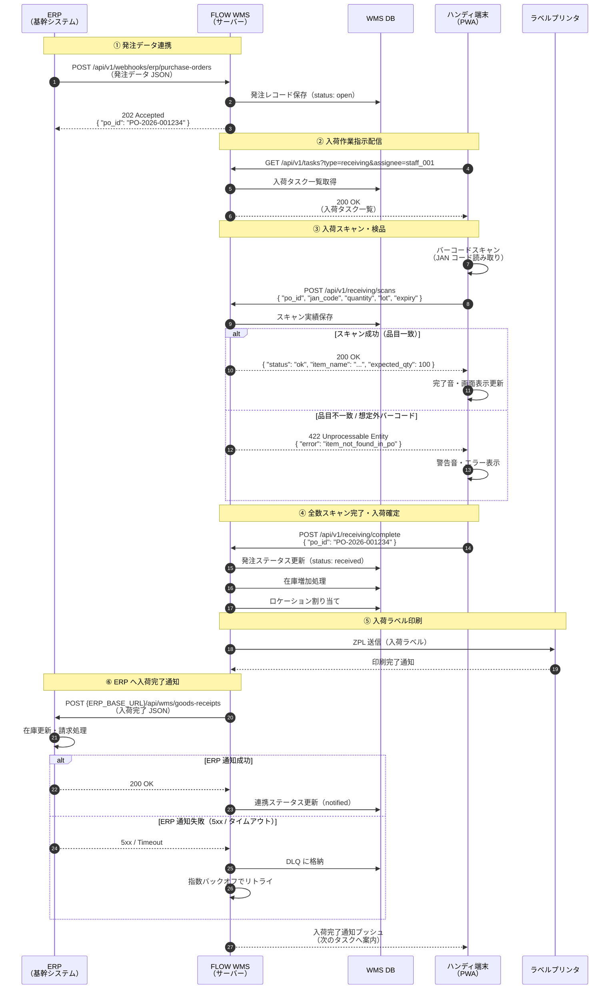
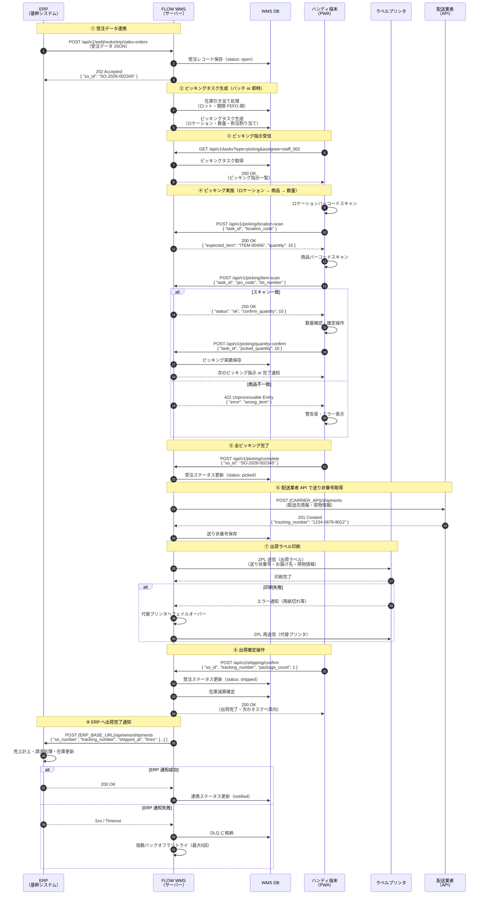

# FLOW WMS システム連携設計仕様書

| 項目 | 内容 |
|------|------|
| ドキュメントID | WMS-SPEC-007 |
| バージョン | 1.0.0 |
| 作成日 | 2026-06-24 |
| ステータス | ドラフト |

## 概要

本仕様書は FLOW WMS における外部システムとの連携設計を定義する。ERP（基幹システム）、EDI（電子データ交換）、ハンディターミナル、フォークリフト/AGV、ラベルプリンタとの連携方式・データフォーマット・エラーハンドリング方針を網羅する。

---

## 1. ERP 連携（発注・受注データ連携）

### 1.1 連携方式

FLOW WMS は ERP との連携において、REST API 方式とファイル連携（CSV）方式の両方に対応する。

| 方式 | 用途 | 優先度 |
|------|------|--------|
| REST API（JSON） | リアルタイム連携（Webhook受信・API呼び出し） | 優先 |
| CSV ファイル連携 | バッチ連携・ERP側がAPI非対応の場合 | 代替 |

### 1.2 連携タイミング

#### リアルタイム連携（Webhook）

ERP 側が発注・受注データを確定した時点で、WMS の Webhook エンドポイントに即時通知する。

```
POST /api/v1/webhooks/erp/purchase-orders
POST /api/v1/webhooks/erp/sales-orders
```

- 認証: HMAC-SHA256 署名検証（`X-ERP-Signature` ヘッダー）
- タイムアウト: 10 秒以内にレスポンスを返す
- 冪等性: `X-Idempotency-Key` ヘッダーによる重複排除

#### バッチ連携（15分間隔）

WMS 側がポーリングする形式と ERP 側からプッシュする形式の双方に対応する。

- スケジュール: 毎時 0, 15, 30, 45 分
- 差分取得: `updated_since` パラメータによる差分フェッチ
- ファイル連携: SFTP サーバー上の指定ディレクトリを監視

### 1.3 データフォーマット

#### 1.3.1 発注データ（Purchase Order）- JSON フォーマット

```json
{
  "event_type": "purchase_order.created",
  "event_id": "evt_20260624_001234",
  "occurred_at": "2026-06-24T09:00:00+09:00",
  "data": {
    "purchase_order": {
      "po_number": "PO-2026-001234",
      "po_date": "2026-06-24",
      "expected_arrival_date": "2026-06-27",
      "supplier": {
        "supplier_code": "SUP-0012",
        "supplier_name": "株式会社サンプル商事",
        "address": "東京都千代田区〇〇1-2-3"
      },
      "warehouse_code": "WH-001",
      "lines": [
        {
          "line_no": 1,
          "item_code": "ITEM-00456",
          "item_name": "サンプル商品A",
          "jan_code": "4901234567890",
          "quantity": 100,
          "unit": "EA",
          "unit_price": 1200.00,
          "lot_required": true,
          "expiry_required": true
        },
        {
          "line_no": 2,
          "item_code": "ITEM-00789",
          "item_name": "サンプル商品B",
          "jan_code": "4901234567891",
          "quantity": 50,
          "unit": "CS",
          "unit_price": 5500.00,
          "lot_required": false,
          "expiry_required": false
        }
      ],
      "memo": "急ぎ入荷対応"
    }
  }
}
```

#### 1.3.2 発注データ（Purchase Order）- CSV フォーマット

```csv
# ヘッダー行
PO番号,PO日付,入荷予定日,仕入先コード,仕入先名,倉庫コード,行番号,品目コード,品目名,JANコード,数量,単位,単価,ロット管理,期限管理

# データ行
PO-2026-001234,2026-06-24,2026-06-27,SUP-0012,株式会社サンプル商事,WH-001,1,ITEM-00456,サンプル商品A,4901234567890,100,EA,1200.00,1,1
PO-2026-001234,2026-06-24,2026-06-27,SUP-0012,株式会社サンプル商事,WH-001,2,ITEM-00789,サンプル商品B,4901234567891,50,CS,5500.00,0,0
```

- 文字コード: UTF-8 BOM付き
- 改行コード: CRLF
- 日付フォーマット: YYYY-MM-DD
- Boolean: 1（真）/ 0（偽）

#### 1.3.3 受注データ（Sales Order）- JSON フォーマット

```json
{
  "event_type": "sales_order.created",
  "event_id": "evt_20260624_002345",
  "occurred_at": "2026-06-24T10:30:00+09:00",
  "data": {
    "sales_order": {
      "so_number": "SO-2026-002345",
      "so_date": "2026-06-24",
      "requested_ship_date": "2026-06-25",
      "priority": "normal",
      "customer": {
        "customer_code": "CST-0078",
        "customer_name": "株式会社テスト得意先",
        "delivery_address": {
          "postal_code": "100-0001",
          "prefecture": "東京都",
          "city": "千代田区",
          "address1": "〇〇町1-1-1",
          "address2": "〇〇ビル5F"
        }
      },
      "warehouse_code": "WH-001",
      "shipping_method": "YAMATO_TA-Q-BIN",
      "lines": [
        {
          "line_no": 1,
          "item_code": "ITEM-00456",
          "item_name": "サンプル商品A",
          "jan_code": "4901234567890",
          "quantity": 10,
          "unit": "EA",
          "lot_designation": null
        }
      ],
      "gift_wrapping": false,
      "memo": ""
    }
  }
}
```

#### 1.3.4 入荷完了通知（WMS → ERP）- JSON フォーマット

```json
{
  "event_type": "goods_receipt.completed",
  "event_id": "evt_wms_20260624_003456",
  "occurred_at": "2026-06-24T14:00:00+09:00",
  "data": {
    "goods_receipt": {
      "gr_number": "GR-2026-003456",
      "po_number": "PO-2026-001234",
      "received_at": "2026-06-24T14:00:00+09:00",
      "received_by": "staff_001",
      "warehouse_code": "WH-001",
      "lines": [
        {
          "line_no": 1,
          "item_code": "ITEM-00456",
          "ordered_quantity": 100,
          "received_quantity": 98,
          "shortage_quantity": 2,
          "lot_number": "LOT-20260620",
          "expiry_date": "2027-06-20",
          "storage_location": "A-01-02-03"
        }
      ]
    }
  }
}
```

### 1.4 エンドポイント仕様

#### WMS 側（受信）

| メソッド | エンドポイント | 説明 |
|----------|----------------|------|
| POST | `/api/v1/webhooks/erp/purchase-orders` | 発注データ受信 |
| POST | `/api/v1/webhooks/erp/sales-orders` | 受注データ受信 |
| GET | `/api/v1/purchase-orders?updated_since={datetime}` | 発注データ差分取得 |
| GET | `/api/v1/sales-orders?updated_since={datetime}` | 受注データ差分取得 |

#### ERP 側（WMS からのコールバック）

| メソッド | エンドポイント | 説明 |
|----------|----------------|------|
| POST | `{ERP_BASE_URL}/api/wms/goods-receipts` | 入荷完了通知 |
| POST | `{ERP_BASE_URL}/api/wms/shipments` | 出荷完了通知 |
| POST | `{ERP_BASE_URL}/api/wms/inventory-adjustments` | 在庫調整通知 |

リクエストヘッダー:

```
Content-Type: application/json
Authorization: Bearer {ACCESS_TOKEN}
X-WMS-Version: 1.0
X-Idempotency-Key: {UUID}
```

### 1.5 エラーハンドリング・リトライ仕様

#### HTTP ステータスコードによる処理分岐

| ステータス | 分類 | 処理 |
|-----------|------|------|
| 200 / 201 | 成功 | 正常完了 |
| 400 | クライアントエラー | リトライなし・アラート通知 |
| 401 / 403 | 認証エラー | トークン再取得後に1回リトライ |
| 409 | 競合（重複） | 冪等として扱い成功とみなす |
| 429 | レート制限 | `Retry-After` ヘッダーに従い待機後リトライ |
| 500 / 502 / 503 | サーバーエラー | 指数バックオフでリトライ |
| タイムアウト | ネットワーク障害 | 指数バックオフでリトライ |

#### 指数バックオフ仕様

```
待機時間 = min(初期待機時間 × 2^(試行回数-1) + ジッター, 最大待機時間)

初期待機時間: 1秒
最大待機時間: 60秒
ジッター: 0〜1秒のランダム値
最大リトライ回数: 5回
```

リトライスケジュール例:

| 試行 | 待機時間（目安） |
|------|----------------|
| 1回目 | 即時 |
| 2回目 | 約1秒後 |
| 3回目 | 約2秒後 |
| 4回目 | 約4秒後 |
| 5回目 | 約8秒後 |
| 6回目（最終） | 約16秒後 |

#### デッドレターキュー（DLQ）

最大リトライ回数を超えた場合、メッセージを DLQ（Dead Letter Queue）に格納し、以下を実施する。

- 管理者へのアラートメール送信
- 管理画面からの手動再送機能を提供
- DLQ 保存期間: 7日間
- DLQ 実装: Amazon SQS DLQ（クラウド環境）/ PostgreSQL テーブル（オンプレミス環境）

---

## 2. EDI 連携（取引先との電子データ交換）

### 2.1 対応 EDI 規格

| 規格 | 説明 | 対応状況 |
|------|------|--------|
| JCA 手順 | 日本チェーンストア協会EDI | 対応 |
| 全銀EDI ZEDI | 全国銀行協会 ZEDI 規格 | 対応 |
| パピルスネット | 医薬品・化粧品向け流通EDI | 対応 |
| EANCOM / GS1 XML | グローバル標準（輸出入対応） | 将来対応予定 |

### 2.2 ASN（事前出荷通知）受信フロー

取引先（仕入先）から入荷前に送付される ASN（Advance Shipment Notice）を受信し、入荷検品作業を効率化する。

#### 受信プロセス

1. EDI サーバーが ASN ファイル（JCA/XML 形式）を受信
2. フォーマット変換サービスが WMS 内部フォーマット（JSON）へ変換
3. WMS が ASN データを DB に登録し入荷予定を作成
4. ハンディ端末に入荷スキャン指示を配信

#### ASN データ変換仕様（JCA → JSON）

JCA 形式の ASN レコード:

```
HDR|ASN-20260624-001|20260624|SUP-0012|株式会社サンプル商事|PO-2026-001234
DTL|1|4901234567890|サンプル商品A|LOT-20260620|20270620|100|EA
DTL|2|4901234567891|サンプル商品B||  |50|CS
TRL|2
```

変換後 JSON:

```json
{
  "asn_number": "ASN-20260624-001",
  "asn_date": "2026-06-24",
  "supplier_code": "SUP-0012",
  "supplier_name": "株式会社サンプル商事",
  "po_number": "PO-2026-001234",
  "lines": [
    {
      "line_no": 1,
      "jan_code": "4901234567890",
      "item_name": "サンプル商品A",
      "lot_number": "LOT-20260620",
      "expiry_date": "2027-06-20",
      "quantity": 100,
      "unit": "EA"
    },
    {
      "line_no": 2,
      "jan_code": "4901234567891",
      "item_name": "サンプル商品B",
      "lot_number": null,
      "expiry_date": null,
      "quantity": 50,
      "unit": "CS"
    }
  ]
}
```

### 2.3 受領確認送信フロー

入荷検品完了後、取引先へ受領確認（Receipt Confirmation）を送信する。

#### 送信プロセス

1. WMS が入荷完了を確定
2. フォーマット変換サービスが内部 JSON を EDI 形式に変換
3. EDI サーバーが取引先へ送信（SFTP / AS2）
4. 送信結果を WMS DB に記録

#### 受領確認データ（JCA 形式）

```
HDR|RC-20260624-001|20260624|WH-001|PO-2026-001234|ASN-20260624-001
DTL|1|4901234567890|100|98|2|SHORT
DTL|2|4901234567891|50|50|0|OK
TRL|2
```

フィールド定義:

| フィールド | 説明 |
|-----------|------|
| RC番号 | 受領確認番号 |
| 受領日 | 実際の入荷確定日 |
| 倉庫コード | 受領倉庫 |
| PO番号 | 紐付く発注番号 |
| ASN番号 | 紐付く ASN 番号 |
| JAN | 商品コード |
| 発注数 | ASN 記載の数量 |
| 受領数 | 実際に受領した数量 |
| 差異数 | 差異数量（正: 過剰、負: 不足） |
| 差異区分 | OK / SHORT / OVER / DAMAGE |

### 2.4 データ変換仕様

- 変換エンジン: 独自変換サービス（Node.js）
- 文字コード: Shift-JIS（JCA規格準拠）↔ UTF-8（内部）の相互変換
- 変換ルール定義: YAML 形式のマッピング定義ファイルで管理（取引先ごとに個別設定可）
- ログ: 変換前・変換後データを両方保存（監査証跡）

---

## 3. ハンディターミナル連携

### 3.1 対応端末

| 項目 | 仕様 |
|------|------|
| OS | Android 10 以上 |
| アプリ形式 | PWA（Progressive Web App）|
| ブラウザ | Chrome 85 以上 / Edge 85 以上 |
| 画面サイズ | 4〜6インチ（縦向き固定） |
| 接続方式 | Wi-Fi（802.11 a/b/g/n/ac）|

### 3.2 バーコード / QR コードスキャン

#### Web Barcode Detection API（優先）

Chrome / Android 環境で利用可能なネイティブ API を優先使用する。

```javascript
// バーコード検出の実装例
const barcodeDetector = new BarcodeDetector({
  formats: [
    'ean_13',      // JAN コード（13桁）
    'ean_8',       // JAN コード（8桁）
    'code_128',    // ロット番号・シリアル番号
    'qr_code',     // QR コード
    'data_matrix', // GS1 DataMatrix
    'itf',         // 物流バーコード（14桁）
  ]
});

async function startScanning(videoElement) {
  const barcodes = await barcodeDetector.detect(videoElement);
  if (barcodes.length > 0) {
    return barcodes[0].rawValue;
  }
  return null;
}
```

#### ZXing.js（フォールバック）

Web Barcode Detection API が利用できない環境向けのフォールバックとして ZXing.js を使用する。

```javascript
// ZXing.js によるスキャン実装例
import { BrowserMultiFormatReader } from '@zxing/library';

const reader = new BrowserMultiFormatReader();

reader.decodeFromVideoDevice(null, 'video-element', (result, error) => {
  if (result) {
    handleScanResult(result.getText());
  }
});
```

#### スキャン性能要件

| 項目 | 要件 |
|------|------|
| 読み取り速度 | 1秒以内 |
| 読み取り距離 | 5cm〜50cm |
| 連続スキャン間隔 | 最低 300ms の debounce |
| 同一コードの重複防止 | 1秒間同一コードを無視 |

### 3.3 オフライン対応

#### Service Worker による資産キャッシュ

```javascript
// service-worker.js の概要
const CACHE_NAME = 'flow-wms-v1';
const STATIC_ASSETS = [
  '/',
  '/app.js',
  '/app.css',
  '/manifest.json',
];

// インストール時に静的資産をキャッシュ
self.addEventListener('install', (event) => {
  event.waitUntil(
    caches.open(CACHE_NAME).then(cache => cache.addAll(STATIC_ASSETS))
  );
});

// フェッチ時: Network First（失敗時はキャッシュにフォールバック）
self.addEventListener('fetch', (event) => {
  if (event.request.url.includes('/api/')) {
    // API リクエストはネットワーク優先
    event.respondWith(networkFirstStrategy(event.request));
  } else {
    // 静的資産はキャッシュ優先
    event.respondWith(cacheFirstStrategy(event.request));
  }
});
```

#### IndexedDB によるオフラインデータ管理

```
IndexedDB スキーマ:

Object Store: pending_operations
  - id: UUID（主キー）
  - operation_type: 'goods_receipt' | 'picking' | 'inventory_adjustment'
  - payload: Object（送信予定データ）
  - created_at: ISO 8601 日時
  - retry_count: Number

Object Store: master_cache
  - key: String（例: 'items', 'locations', 'orders'）
  - data: Object[]
  - cached_at: ISO 8601 日時
  - expires_at: ISO 8601 日時
```

オフライン動作方針:

- マスタデータ（商品・ロケーション・作業指示）は作業開始前にダウンロードしキャッシュ
- スキャン結果は `pending_operations` に即時保存
- オフライン中は画面上部に「オフラインモード」バナーを表示
- マスタキャッシュ有効期限: 8時間（シフト単位での更新を想定）

### 3.4 Bluetooth スキャナー対応

#### Web Bluetooth API

```javascript
// Bluetooth HID スキャナーのペアリング例
async function connectBluetoothScanner() {
  const device = await navigator.bluetooth.requestDevice({
    filters: [{ services: ['human_interface_device'] }]
  });

  const server = await device.gatt.connect();
  const service = await server.getPrimaryService('human_interface_device');
  const characteristic = await service.getCharacteristic('report');

  characteristic.addEventListener('characteristicvaluechanged', (event) => {
    const scanData = parseHIDReport(event.target.value);
    handleScanResult(scanData);
  });

  await characteristic.startNotifications();
  return device;
}
```

対応スキャナー:

| メーカー | モデル例 | 接続方式 |
|---------|---------|--------|
| Zebra | CS60 / DS2278 | Bluetooth HID |
| Honeywell | Voyager 1602g | Bluetooth HID |
| Datalogic | QuickScan QM2430 | Bluetooth HID |

### 3.5 ネットワーク復旧時のデータ同期方式

```
同期フロー:
1. オンライン復旧を Network Information API で検知
   → navigator.connection の 'change' イベント
2. pending_operations を created_at 昇順で全件取得
3. 1件ずつ順次 API 送信（並列送信による順序崩れを防止）
4. 送信成功 → pending_operations から削除
5. 送信失敗（サーバーエラー）→ retry_count をインクリメント
   retry_count >= 3 の場合は管理者へ通知
6. 全件同期完了後、マスタデータを再取得して最新化
```

競合解決方針:

- WMS サーバー側のタイムスタンプを正とする（Server Wins）
- ただし「スキャン実績」は端末側のデータを優先（Client Wins）
- 競合が発生した場合は管理画面で手動解決できるようにログ保存

---

## 4. フォークリフト / AGV 連携

### 4.1 作業指示プロトコル

#### REST API ポーリング方式（フォークリフト向け）

フォークリフト搭載の車載端末が定期的に WMS に作業指示を問い合わせる。

```
GET /api/v1/forklift/tasks?device_id={DEVICE_ID}&status=pending
Authorization: Bearer {DEVICE_TOKEN}

レスポンス例:
{
  "tasks": [
    {
      "task_id": "TASK-20260624-001",
      "task_type": "putaway",
      "priority": 1,
      "from_location": "入荷バース-01",
      "to_location": "A-01-02-03",
      "item_code": "ITEM-00456",
      "quantity": 100,
      "pallet_id": "PLT-0001",
      "instruction": "パレット1段積み"
    }
  ]
}
```

ポーリング間隔: 5秒（作業完了後は即座に次の指示を取得）

#### WebSocket Push 方式（AGV 向け）

AGV（自動搬送車）には WebSocket による双方向リアルタイム通信を使用する。

```
接続エンドポイント:
wss://{WMS_HOST}/ws/agv/{AGV_ID}

WMS → AGV 指示メッセージ:
{
  "type": "task_assigned",
  "task_id": "TASK-20260624-002",
  "task_type": "transport",
  "from": { "x": 10.5, "y": 20.3, "zone": "A" },
  "to":   { "x": 45.0, "y": 15.8, "zone": "B" },
  "payload": { "pallet_id": "PLT-0002", "weight_kg": 120 }
}

AGV → WMS 状態報告:
{
  "type": "status_update",
  "task_id": "TASK-20260624-002",
  "status": "in_progress",
  "current_position": { "x": 25.3, "y": 18.1 },
  "battery_level": 78,
  "timestamp": "2026-06-24T10:35:00+09:00"
}
```

### 4.2 位置情報連携（フロアマップ上リアルタイム表示）

- AGV/フォークリフトは 1 秒ごとに現在座標を WMS へ送信
- WMS 管理画面でフロアマップ（SVG）上にリアルタイムで位置をオーバーレイ表示
- 座標系: 倉庫左下を原点とするメートル座標（X, Y）
- フロアマップ定義: JSON 形式（ゾーン・通路・ラック・充電ステーション）

```json
{
  "floor_map": {
    "width_m": 100,
    "height_m": 60,
    "zones": [
      { "zone_id": "A", "label": "Aゾーン", "x": 0, "y": 0, "width": 40, "height": 60 },
      { "zone_id": "B", "label": "Bゾーン", "x": 40, "y": 0, "width": 60, "height": 60 }
    ]
  }
}
```

### 4.3 完了報告受信

フォークリフト / AGV から作業完了報告を受信し、WMS の在庫情報を更新する。

```
POST /api/v1/forklift/tasks/{task_id}/complete
{
  "completed_at": "2026-06-24T10:40:00+09:00",
  "device_id": "FLK-001",
  "operator_id": "staff_002",
  "actual_quantity": 100,
  "actual_location": "A-01-02-03",
  "note": ""
}
```

### 4.4 エラー・緊急停止ハンドリング

| エラー種別 | 検知方法 | WMS の対応 |
|-----------|---------|-----------|
| AGV 障害物検知 | WebSocket エラーイベント受信 | タスク中断・管理者アラート |
| AGV バッテリー低下 | battery_level < 15% | タスク完了後に充電ステーションへ誘導 |
| AGV 通信途絶 | 30秒以上メッセージなし | 安全停止コマンド送信・アラート |
| フォークリフト緊急停止ボタン | 車載端末からの緊急通知 | 当該デバイスの全タスク凍結・管理者通知 |

緊急停止コマンド（WMS → AGV）:

```json
{
  "type": "emergency_stop",
  "reason": "communication_timeout",
  "issued_at": "2026-06-24T10:45:00+09:00"
}
```

---

## 5. ラベルプリンタ連携

### 5.1 対応プロトコル

| プロトコル | 説明 | 用途 |
|-----------|------|------|
| ZPL（Zebra Programming Language） | Zebra プリンタ向けネイティブ言語 | 主要プロトコル |
| IPP（Internet Printing Protocol） | 標準印刷プロトコル（RFC 8011） | 汎用プリンタ向け |

### 5.2 対応プリンタ機種

| メーカー | シリーズ | 型番例 | 接続方式 |
|---------|---------|--------|---------|
| Zebra | ZT シリーズ（産業用） | ZT230 / ZT410 / ZT610 | LAN / USB |
| Zebra | ZD シリーズ（デスクトップ用） | ZD220 / ZD420 / ZD620 | LAN / USB / Bluetooth |
| SATO | CL シリーズ | CL4NX / CL6NX | LAN |
| ブラザー | RJ シリーズ（モバイル） | RJ-3250WB | Wi-Fi / Bluetooth |

### 5.3 ラベル印刷種別

#### 入荷ラベル

印刷タイミング: 入荷検品完了後

記載内容:
- 品目コード・品目名
- JAN コード（バーコード）
- ロット番号・有効期限
- 数量・単位
- 入荷日・入荷担当者
- ロケーションコード（格納先）
- WMS 管理番号（QR コード）

#### ピッキングラベル

印刷タイミング: ピッキングタスク生成時（事前印刷）または ピッキング完了時

記載内容:
- 受注番号・出荷日
- お届け先（氏名・住所）
- 品目コード・品目名・数量
- ピッキングロケーション
- ピッキング担当者・ピッキング日時

#### 出荷ラベル（送り状）

印刷タイミング: 出荷確定時

記載内容:
- 送り状番号（バーコード）
- 配送業者コード
- お届け先情報
- 発送元倉庫情報
- 荷物番号・総荷物数

### 5.4 プリンタキュー管理・エラーハンドリング

#### キュー管理方式

```
印刷キュー（PostgreSQL テーブル: print_queue）
  - job_id: UUID
  - printer_id: String（印刷先プリンタID）
  - label_type: 'arrival' | 'picking' | 'shipping'
  - template_id: String
  - data: JSONB（差し込みデータ）
  - status: 'pending' | 'printing' | 'completed' | 'failed'
  - created_at: Timestamp
  - printed_at: Timestamp
  - error_message: Text
  - retry_count: Integer
```

#### エラーハンドリング

| エラー種別 | 対応 |
|-----------|------|
| プリンタ未接続 | 5秒待機後リトライ（最大3回）|
| 用紙切れ | アラート通知・代替プリンタへ自動切り替え |
| リボン切れ | アラート通知・印刷ジョブ保留 |
| 通信タイムアウト | 30秒タイムアウト・リトライ最大3回 |
| 最大リトライ超過 | 管理者通知・手動対応 |

プリンタ死活監視:

- 1分ごとにプリンタへ `~HS` コマンド（ZPL ホストステータス）を送信
- 応答なしの場合はプリンタをオフライン扱い・代替プリンタへフェイルオーバー

### 5.5 ZPL テンプレート例

#### 入荷ラベル（100mm × 75mm）

```zpl
^XA
^CI28

^FO20,20
^A0N,40,40
^FD入荷ラベル^FS

^FO20,70
^A0N,25,25
^FD品目: {ITEM_CODE} {ITEM_NAME}^FS

^FO20,110
^BY2,3,60
^BCN,80,Y,N,N
^FD{JAN_CODE}^FS

^FO20,210
^A0N,22,22
^FDロット: {LOT_NUMBER}^FS

^FO20,240
^A0N,22,22
^FD期限: {EXPIRY_DATE}^FS

^FO20,270
^A0N,22,22
^FD数量: {QUANTITY} {UNIT}^FS

^FO20,300
^A0N,22,22
^FD格納先: {LOCATION}^FS

^FO20,330
^A0N,22,22
^FD入荷日: {ARRIVAL_DATE}^FS

^FO350,260
^BQN,2,5
^FDMA,{WMS_CONTROL_NUMBER}^FS

^FO20,370
^A0N,18,18
^FD担当: {OPERATOR_NAME}^FS

^XZ
```

#### 出荷ラベル（100mm × 150mm）

```zpl
^XA
^CI28

^FO20,20
^A0N,35,35
^FD出荷ラベル^FS

^FO20,65
^A0N,20,20
^FD受注番号: {SO_NUMBER}^FS

^FO20,95
^A0N,20,20
^FD出荷日: {SHIP_DATE}^FS

^FO20,130
^A0N,25,25
^FDお届け先:^FS

^FO20,160
^A0N,22,22
^FD{CUSTOMER_NAME}^FS

^FO20,190
^A0N,20,20
^FD〒{POSTAL_CODE}^FS

^FO20,215
^A0N,20,20
^FD{ADDRESS}^FS

^FO20,260
^BY2,3,70
^BCN,90,Y,N,N
^FD{TRACKING_NUMBER}^FS

^FO20,370
^A0N,20,20
^FD荷物: {PACKAGE_NO}/{TOTAL_PACKAGES}^FS

^FO20,400
^A0N,20,20
^FD配送: {CARRIER}^FS

^XZ
```

プレースホルダー（`{...}`）はサーバーサイドで差し込み後、プリンタへ送信する。

---

## 6. 連携シーケンス図

### 6-1. 入荷フロー（ERP → WMS → ハンディ端末）



---

### 6-2. 出荷フロー（ERP → WMS → ハンディ端末 → ラベルプリンタ）



---

## 付録 A. 連携エンドポイント一覧

| No. | 方向 | メソッド | パス | 説明 |
|-----|------|----------|------|------|
| 1 | ERP → WMS | POST | `/api/v1/webhooks/erp/purchase-orders` | 発注データ受信 |
| 2 | ERP → WMS | POST | `/api/v1/webhooks/erp/sales-orders` | 受注データ受信 |
| 3 | WMS → ERP | POST | `{ERP}/api/wms/goods-receipts` | 入荷完了通知 |
| 4 | WMS → ERP | POST | `{ERP}/api/wms/shipments` | 出荷完了通知 |
| 5 | HT → WMS | GET | `/api/v1/tasks` | タスク一覧取得 |
| 6 | HT → WMS | POST | `/api/v1/receiving/scans` | 入荷スキャン登録 |
| 7 | HT → WMS | POST | `/api/v1/receiving/complete` | 入荷確定 |
| 8 | HT → WMS | POST | `/api/v1/picking/location-scan` | ピッキングロケーションスキャン |
| 9 | HT → WMS | POST | `/api/v1/picking/item-scan` | ピッキング商品スキャン |
| 10 | HT → WMS | POST | `/api/v1/picking/complete` | ピッキング完了 |
| 11 | HT → WMS | POST | `/api/v1/shipping/confirm` | 出荷確定 |
| 12 | WMS → FLK | GET | `/api/v1/forklift/tasks` | フォークリフト作業指示 |
| 13 | FLK → WMS | POST | `/api/v1/forklift/tasks/{id}/complete` | フォークリフト完了報告 |
| 14 | WMS ↔ AGV | WS | `wss://{host}/ws/agv/{id}` | AGV 双方向通信 |

## 付録 B. 改訂履歴

| バージョン | 日付 | 変更内容 | 担当 |
|-----------|------|---------|------|
| 1.0.0 | 2026-06-24 | 初版作成 | - |
