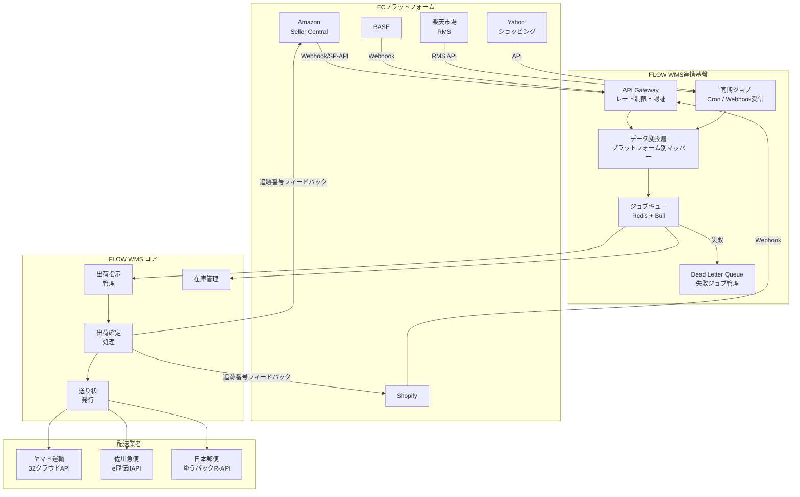
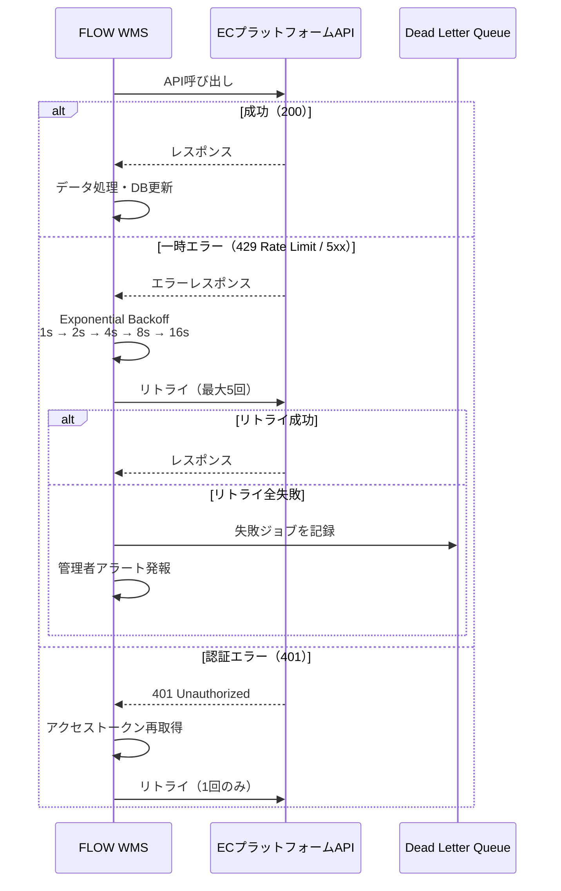
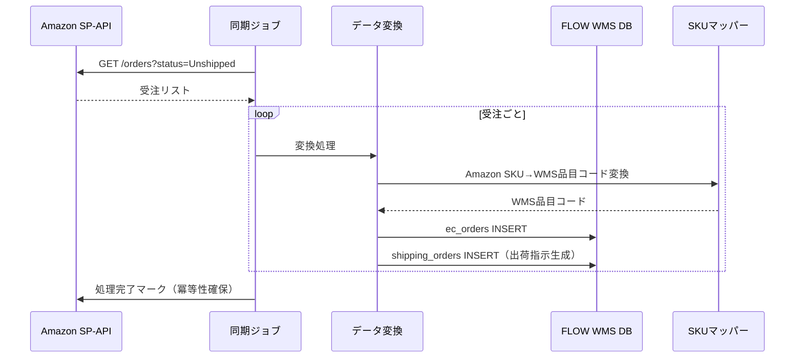
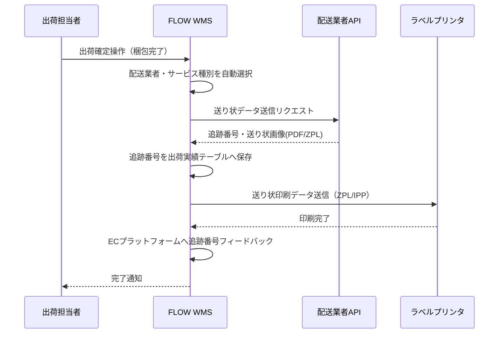

# FLOW WMS EC連携設計仕様書

**文書番号**: FLOW-WMS-SPEC-009  
**バージョン**: 1.0  
**作成日**: 2026-06-24  
**ステータス**: ドラフト

---

## 1. 概要

### 1.1 目的

本仕様書は、FLOW WMSとECプラットフォーム（Amazon・楽天市場・Yahoo!ショッピング・Shopify・BASE）および国内配送業者（ヤマト運輸・佐川急便・日本郵便）との連携仕様を定義する。

EC連携はFLOW WMSがT-WINSや従来型WMSに対して持つ最大の差別化要素であり、中小EC事業者・3PL事業者への価値提供の核となる。

### 1.2 連携対象一覧

| カテゴリ | 連携先 | 優先度 | Phase |
|--------|------|------|-------|
| ECプラットフォーム | Amazon Seller Central | 最高 | Phase 1 |
| ECプラットフォーム | Shopify | 最高 | Phase 1 |
| 配送業者 | ヤマト運輸（B2クラウド） | 最高 | Phase 1 |
| 配送業者 | 佐川急便（e飛伝III） | 高 | Phase 1 |
| 配送業者 | 日本郵便（ゆうパックR） | 高 | Phase 1 |
| ECプラットフォーム | 楽天市場（RMS） | 高 | Phase 2 |
| ECプラットフォーム | Yahoo!ショッピング | 中 | Phase 2 |
| ECプラットフォーム | BASE | 中 | Phase 2 |

### 1.3 連携アーキテクチャ概要



---

## 2. ECプラットフォーム連携仕様

### 2.1 共通仕様

#### 2.1.1 認証方式

| プラットフォーム | 認証方式 | トークン管理 |
|--------------|--------|-----------|
| Amazon | OAuth 2.0（SP-API LWA） | Refresh Tokenをシステム設定で暗号化保存 |
| Shopify | OAuth 2.0 / Private App APIキー | Shopifyストアごとにアクセストークン管理 |
| 楽天市場 | APIキー（Service Secret + License Key） | テナント設定で暗号化保存 |
| Yahoo!ショッピング | OAuth 2.0 | アクセストークン自動更新 |
| BASE | OAuth 2.0 | アクセストークン自動更新 |

#### 2.1.2 エラーハンドリング・リトライ設計



#### 2.1.3 データ変換フロー

```
ECプラットフォーム受注データ
↓ プラットフォーム別マッパー
FLOW WMS標準受注フォーマット（以下の共通スキーマ）
↓ 出荷指示生成ロジック
出荷指示（shipping_orders）テーブルへ登録
```

**共通受注スキーマ（内部形式）:**

```typescript
interface ECOrder {
  externalOrderId: string;       // プラットフォーム側の受注番号
  platform: 'amazon' | 'shopify' | 'rakuten' | 'yahoo' | 'base';
  orderDate: Date;
  customer: {
    name: string;
    postalCode: string;
    prefecture: string;
    address1: string;
    address2?: string;
    phone: string;
    email?: string;
  };
  items: Array<{
    skuCode: string;             // プラットフォーム側SKU
    flowWmsItemCode?: string;    // マッピング後のFLOW WMS品目コード
    name: string;
    quantity: number;
    unitPrice: number;
  }>;
  shipping: {
    method: string;              // 配送方法（例: 'standard', 'express'）
    requestedDate?: Date;        // 配送希望日
    requestedTimeSlot?: string;  // 時間指定
    isCoolDelivery: boolean;     // クール便フラグ
    isCashOnDelivery: boolean;   // 代引きフラグ
  };
  giftOptions?: {
    isGift: boolean;
    wrapType?: string;           // 包装種別
    message?: string;            // メッセージ
  };
  externalStatus: string;        // プラットフォーム側ステータス
  rawPayload: Record<string, unknown>; // 元データ保持（デバッグ用）
}
```

---

### 2.2 Amazon Seller Central連携

#### 2.2.1 連携範囲

| 機能 | API | 方向 | 頻度 |
|-----|-----|------|------|
| 受注取込 | SP-API Orders API | Amazon→WMS | Webhookまたは5分ポーリング |
| 在庫同期 | SP-API Inventory API | WMS→Amazon | 在庫更新時（イベント駆動） |
| 出荷確定通知 | SP-API Orders API（出荷確定） | WMS→Amazon | 出荷確定時 |
| 追跡番号登録 | SP-API Orders API | WMS→Amazon | 送り状発行後 |
| キャンセル受信 | SP-API Orders API | Amazon→WMS | Webhook |

#### 2.2.2 受注取込シーケンス



#### 2.2.3 在庫同期（WMS→Amazon）

- FLOW WMS上で在庫が更新（入荷確定・出荷確定・在庫調整）された際に非同期でAmazon在庫を更新
- `SP-API Inventory API PATCH /fba/inventory/v1/items/{sellerSku}`
- 在庫不整合を防ぐため更新は楽観的ロック確認後に実行

---

### 2.3 Shopify連携

#### 2.3.1 連携範囲

| 機能 | 方向 | 頻度 |
|-----|------|------|
| 受注取込 | Shopify→WMS | Webhook（orders/create・orders/updated） |
| 出荷確定通知 | WMS→Shopify | 出荷確定時 |
| 追跡番号登録 | WMS→Shopify | 送り状発行後 |
| 在庫同期 | WMS→Shopify | 在庫更新時（イベント駆動） |
| 返金処理 | WMS→Shopify | 返品検品完了後 |

#### 2.3.2 Webhook受信フロー

```
POST /api/webhooks/shopify/{tenantId}
↓ HMAC-SHA256 署名検証（shopify-webhook-signature ヘッダー）
↓ ペイロードをキューへエンキュー
↓ 200 OK 即時返却（Shopifyは5秒タイムアウト）
↓ 非同期でデータ変換・DB保存
```

#### 2.3.3 返金API連携

出荷済み受注に対して返品検品完了後、Shopify Refund APIで自動返金指示を発行する。

```
POST /admin/api/2024-01/orders/{order_id}/refunds.json
{
  "refund": {
    "note": "FLOW WMS 返品処理 - {return_id}",
    "refund_line_items": [...],
    "transactions": [{ "kind": "refund", "amount": "..." }]
  }
}
```

---

### 2.4 楽天市場（RMS）連携

#### 2.4.1 連携範囲

| 機能 | API | 方向 | 頻度 |
|-----|-----|------|------|
| 受注取込 | RMS Order API | 楽天→WMS | 5分ポーリング |
| 在庫同期 | RMS Inventory API | WMS→楽天 | 在庫更新時 |
| 出荷確定通知 | RMS Order API（配送完了報告） | WMS→楽天 | 出荷確定時 |

#### 2.4.2 注意事項

- 楽天RMS APIはレート制限が厳しい（1分あたり60リクエスト）
- ポーリング間隔は5分以上を設定し、リクエスト数を管理すること
- ポイント付与・クーポン情報はFLOW WMS側では管理せず、金額情報のみ取込む

---

### 2.5 Yahoo!ショッピング連携

#### 2.5.1 連携範囲

| 機能 | 方向 | 頻度 |
|-----|------|------|
| 受注取込 | Yahoo→WMS | 5分ポーリング |
| 在庫同期 | WMS→Yahoo | 在庫更新時 |
| 出荷確定通知 | WMS→Yahoo | 出荷確定時 |

---

### 2.6 BASE連携

#### 2.6.1 連携範囲

| 機能 | 方向 | 頻度 |
|-----|------|------|
| 受注取込 | BASE→WMS | Webhook |
| 在庫同期 | WMS→BASE | 在庫更新時 |
| 出荷確定通知 | WMS→BASE | 出荷確定時 |

---

## 3. 配送業者API連携仕様

### 3.1 共通仕様

#### 3.1.1 送り状発行フロー



#### 3.1.2 配送業者自動選択ロジック

```
優先順位:
1. 配送先住所の地域別最安値業者
2. 配送オプション（クール便 → ヤマトクール/佐川クール）
3. サイズ・重量制限（ネコポス: 〜2.5cm厚、〜1kg）
4. 配送希望日・時間指定対応可否
5. マスタで設定したデフォルト業者（テナント設定）
```

### 3.2 ヤマト運輸（B2クラウドAPI）

#### 3.2.1 対応サービス

| サービス | 用途 | サイズ制限 | 重量制限 |
|--------|-----|---------|--------|
| 宅急便 | 標準配送 | 3辺合計160cm | 25kg |
| ネコポス | 小型商品 | A4・厚さ3cm | 1kg |
| 宅急便コンパクト | 専用BOX | 専用BOX | 〜 |
| クール宅急便（冷蔵） | 食品・冷蔵 | 160cm | 25kg |
| クール宅急便（冷凍） | 食品・冷凍 | 160cm | 25kg |

#### 3.2.2 API仕様

- **エンドポイント**: `https://b2c-api.kuronekoyamato.co.jp/api/v1/`
- **認証**: APIキー（Bearer Token）
- **送り状発行リクエスト**:

```json
{
  "shipper": {
    "name": "FLOW WMS テナント名",
    "postalCode": "XXX-XXXX",
    "address": "...",
    "phone": "..."
  },
  "receiver": {
    "name": "配送先氏名",
    "postalCode": "XXX-XXXX",
    "address": "...",
    "phone": "..."
  },
  "parcel": {
    "weight": 1.5,
    "sizeCode": "60",
    "serviceCode": "0030",  // 宅急便
    "deliveryDate": "2026-06-25",
    "deliveryTimeCode": "0004"  // 14〜16時指定
  }
}
```

- **レスポンス**: 追跡番号（12桁）・ZPL形式の送り状データ

---

### 3.3 佐川急便（e飛伝III API）

#### 3.3.1 対応サービス

| サービス | 用途 |
|--------|-----|
| 飛脚宅配便 | 標準配送 |
| 飛脚ラージサイズ宅配便 | 大型商品 |
| 飛脚航空便 | 翌日配送 |
| 飛脚クール便（冷蔵） | 食品・冷蔵 |
| 飛脚クール便（冷凍） | 食品・冷凍 |

#### 3.3.2 API仕様

- **エンドポイント**: `https://api.sagawa-express.co.jp/ehi-api/v3/`
- **認証**: APIキー + 顧客コード
- **送り状発行・追跡番号取得**: RESTful JSON API

---

### 3.4 日本郵便（ゆうパックR-API）

#### 3.4.1 対応サービス

| サービス | 用途 |
|--------|-----|
| ゆうパック | 標準配送 |
| ゆうパケット | 小型商品（厚さ3cm・4kg以内） |
| ゆうパケットポスト | ポスト投函対応 |
| ゆうメール | 小型冊子・CD/DVD |

#### 3.4.2 API仕様

- **エンドポイント**: `https://api.post.japanpost.jp/`
- **認証**: OAuth 2.0（Client Credentials）
- **送り状発行・追跡番号取得**: RESTful JSON API

---

## 4. データベース設計（EC連携追加テーブル）

### 4.1 追加テーブル

#### ec_platform_settings（ECプラットフォーム設定）

```sql
CREATE TABLE ec_platform_settings (
    id              UUID PRIMARY KEY DEFAULT gen_random_uuid(),
    warehouse_id    UUID NOT NULL REFERENCES warehouses(id),
    platform        VARCHAR(20) NOT NULL,  -- 'amazon', 'shopify', 'rakuten', 'yahoo', 'base'
    shop_id         VARCHAR(255),          -- ショップID（Shopifyドメイン等）
    credentials     JSONB NOT NULL,        -- 認証情報（暗号化）
    sync_enabled    BOOLEAN DEFAULT true,
    last_synced_at  TIMESTAMP WITH TIME ZONE,
    created_at      TIMESTAMP WITH TIME ZONE DEFAULT NOW(),
    UNIQUE (warehouse_id, platform, shop_id)
);
```

#### ec_orders（EC受注テーブル）

```sql
CREATE TABLE ec_orders (
    id                  UUID PRIMARY KEY DEFAULT gen_random_uuid(),
    warehouse_id        UUID NOT NULL REFERENCES warehouses(id),
    platform            VARCHAR(20) NOT NULL,
    external_order_id   VARCHAR(255) NOT NULL,
    order_date          TIMESTAMP WITH TIME ZONE NOT NULL,
    customer_name       VARCHAR(255) NOT NULL,
    customer_postal     VARCHAR(10) NOT NULL,
    customer_address    TEXT NOT NULL,
    customer_phone      VARCHAR(20),
    shipping_method     VARCHAR(100),
    is_gift             BOOLEAN DEFAULT false,
    gift_options        JSONB,
    raw_payload         JSONB,              -- 元データ保持
    shipping_order_id   UUID REFERENCES shipping_orders(id),
    status              VARCHAR(50) DEFAULT 'pending',
    created_at          TIMESTAMP WITH TIME ZONE DEFAULT NOW(),
    UNIQUE (platform, external_order_id)
);

CREATE INDEX idx_ec_orders_warehouse ON ec_orders (warehouse_id, status);
CREATE INDEX idx_ec_orders_created ON ec_orders (created_at);
```

#### sku_mappings（SKUマッピングテーブル）

```sql
CREATE TABLE sku_mappings (
    id              UUID PRIMARY KEY DEFAULT gen_random_uuid(),
    warehouse_id    UUID NOT NULL REFERENCES warehouses(id),
    platform        VARCHAR(20) NOT NULL,
    platform_sku    VARCHAR(255) NOT NULL,
    item_id         UUID NOT NULL REFERENCES items(id),
    created_at      TIMESTAMP WITH TIME ZONE DEFAULT NOW(),
    UNIQUE (warehouse_id, platform, platform_sku)
);
```

#### carrier_settings（配送業者設定テーブル）

```sql
CREATE TABLE carrier_settings (
    id              UUID PRIMARY KEY DEFAULT gen_random_uuid(),
    warehouse_id    UUID NOT NULL REFERENCES warehouses(id),
    carrier         VARCHAR(50) NOT NULL,  -- 'yamato', 'sagawa', 'japanpost'
    customer_code   VARCHAR(100),
    api_key         TEXT,                  -- 暗号化
    service_codes   JSONB,                 -- 利用サービスコード一覧
    is_default      BOOLEAN DEFAULT false,
    created_at      TIMESTAMP WITH TIME ZONE DEFAULT NOW(),
    UNIQUE (warehouse_id, carrier)
);
```

#### shipment_labels（送り状テーブル）

```sql
CREATE TABLE shipment_labels (
    id                  UUID PRIMARY KEY DEFAULT gen_random_uuid(),
    shipping_order_id   UUID NOT NULL REFERENCES shipping_orders(id),
    carrier             VARCHAR(50) NOT NULL,
    service_code        VARCHAR(50),
    tracking_number     VARCHAR(100) NOT NULL,
    label_data          TEXT,              -- ZPL / Base64 PDF
    label_format        VARCHAR(10),       -- 'zpl', 'pdf'
    issued_at           TIMESTAMP WITH TIME ZONE DEFAULT NOW(),
    printed_at          TIMESTAMP WITH TIME ZONE
);

CREATE INDEX idx_shipment_labels_tracking ON shipment_labels (tracking_number);
```

#### returns（返品テーブル）

```sql
CREATE TABLE returns (
    id                  UUID PRIMARY KEY DEFAULT gen_random_uuid(),
    warehouse_id        UUID NOT NULL REFERENCES warehouses(id),
    return_number       VARCHAR(50) UNIQUE NOT NULL,
    shipping_order_id   UUID REFERENCES shipping_orders(id),
    ec_order_id         UUID REFERENCES ec_orders(id),
    return_reason       VARCHAR(255) NOT NULL,
    handling_method     VARCHAR(50) NOT NULL,  -- 'restock', 'dispose', 'return_to_supplier'
    inspection_result   VARCHAR(20),           -- 'good', 'defective'
    refund_amount       NUMERIC(12, 2),
    refund_status       VARCHAR(20) DEFAULT 'pending',
    received_at         TIMESTAMP WITH TIME ZONE,
    inspected_at        TIMESTAMP WITH TIME ZONE,
    created_at          TIMESTAMP WITH TIME ZONE DEFAULT NOW()
);
```

---

## 5. API設計（EC連携追加エンドポイント）

### 5.1 ECプラットフォーム連携API

| メソッド | パス | 説明 |
|---------|-----|------|
| GET | `/api/ec/platforms` | 連携設定一覧取得 |
| POST | `/api/ec/platforms` | ECプラットフォーム連携設定登録 |
| PUT | `/api/ec/platforms/{id}` | 連携設定更新 |
| DELETE | `/api/ec/platforms/{id}` | 連携設定削除 |
| POST | `/api/ec/sync/{platformId}` | 手動同期実行 |
| GET | `/api/ec/orders` | EC受注一覧取得 |
| GET | `/api/ec/orders/{id}` | EC受注詳細取得 |

### 5.2 Webhook受信エンドポイント

| メソッド | パス | 説明 |
|---------|-----|------|
| POST | `/api/webhooks/shopify/{tenantId}` | Shopify Webhook受信 |
| POST | `/api/webhooks/amazon/{tenantId}` | Amazon SNS通知受信 |
| POST | `/api/webhooks/base/{tenantId}` | BASE Webhook受信 |

### 5.3 配送業者API

| メソッド | パス | 説明 |
|---------|-----|------|
| GET | `/api/carriers` | 配送業者設定一覧 |
| POST | `/api/carriers` | 配送業者設定登録 |
| POST | `/api/shipping-labels` | 送り状発行 |
| GET | `/api/shipping-labels/{id}` | 送り状情報取得 |
| GET | `/api/shipping-labels/{id}/download` | 送り状PDF/ZPLダウンロード |

### 5.4 返品管理API

| メソッド | パス | 説明 |
|---------|-----|------|
| GET | `/api/returns` | 返品一覧取得 |
| POST | `/api/returns` | 返品受付登録 |
| GET | `/api/returns/{id}` | 返品詳細取得 |
| PUT | `/api/returns/{id}/inspect` | 返品検品結果登録 |
| POST | `/api/returns/{id}/refund` | 返金指示実行 |

### 5.5 SKUマッピングAPI

| メソッド | パス | 説明 |
|---------|-----|------|
| GET | `/api/sku-mappings` | SKUマッピング一覧 |
| POST | `/api/sku-mappings` | SKUマッピング登録 |
| PUT | `/api/sku-mappings/{id}` | SKUマッピング更新 |
| DELETE | `/api/sku-mappings/{id}` | SKUマッピング削除 |
| POST | `/api/sku-mappings/import` | CSVによる一括インポート |

---

## 6. セキュリティ設計

### 6.1 認証情報の保護

- ECプラットフォームのAPIキー・アクセストークンはDB保存前にAES-256-GCMで暗号化
- 暗号化キーはシステム環境変数（`EC_CREDENTIAL_KEY`）で管理し、DBには保存しない
- 配送業者APIキーも同様に暗号化して保管

### 6.2 Webhook署名検証

```typescript
// Shopify HMAC-SHA256 署名検証
function verifyShopifyWebhook(body: string, signature: string, secret: string): boolean {
  const hmac = crypto.createHmac('sha256', secret);
  hmac.update(body, 'utf8');
  const digest = hmac.digest('base64');
  return crypto.timingSafeEqual(Buffer.from(signature), Buffer.from(digest));
}
```

- Amazon SNS: SNS署名証明書を都度検証（公開URLから証明書取得・キャッシュ）

### 6.3 冪等性の確保

- EC受注の重複取込防止: `UNIQUE(platform, external_order_id)` 制約
- 送り状発行の重複防止: `shipping_order_id` に対する発行状態チェック
- Webhook受信の冪等性: 受信ID（`X-Request-Id`）をRedisで30分キャッシュして重複処理を防止

---

## 7. 監視・アラート設計

### 7.1 同期ジョブ監視

| 監視項目 | しきい値 | アラートレベル |
|--------|--------|-------------|
| 受注同期遅延 | 15分以上未同期 | Warning |
| 受注同期停止 | 30分以上未同期 | Critical |
| DLQジョブ件数 | 10件以上 | Warning |
| DLQジョブ件数 | 50件以上 | Critical |
| 送り状発行エラー率 | 5%以上 | Warning |

### 7.2 連携状態ダッシュボード

- 各ECプラットフォームの接続状態（Connected / Disconnected / Error）
- 最終同期時刻
- 当日受注取込件数・成功/失敗数
- 未処理DLQジョブ一覧と再実行ボタン

---

*本ドキュメントは FLOW WMS のEC連携設計を定義するものです。機能要件は「02_機能要件.md」、システム連携の全体方針は「07_システム連携設計.md」を参照してください。*
